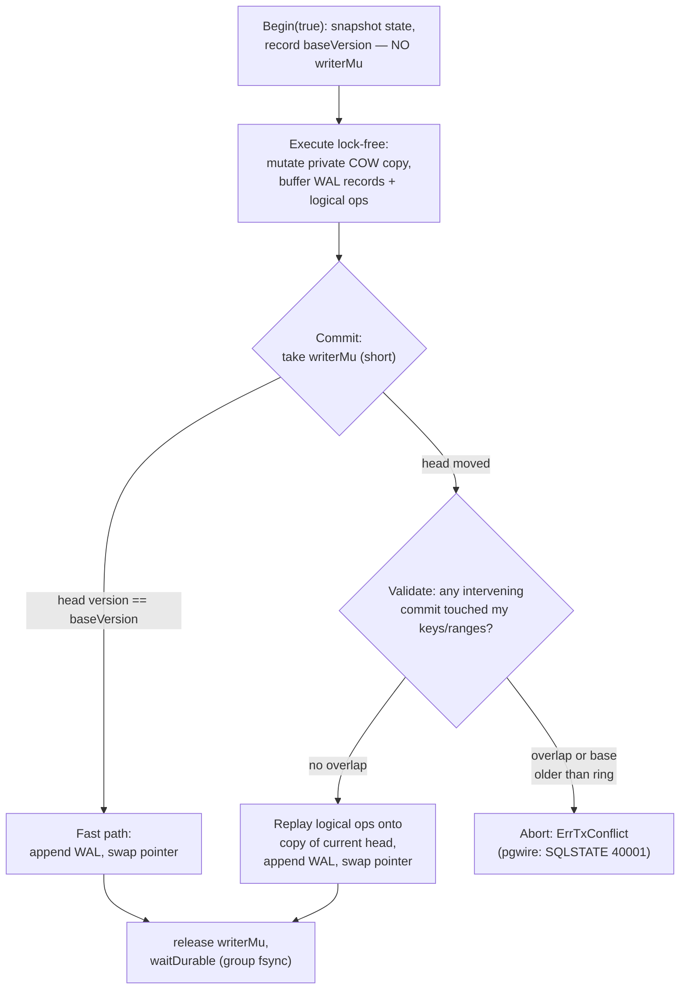

# Concurrent Writes via Optimistic Concurrency Control (OCC)

**Status:** design — not yet implemented
**Scope:** btypedb (kv layer), bytdb (SQL layer), pgwire (protocol surface)
**Date:** 2026-07-30

## Problem

Writable transactions serialize on a single lock held for their entire
lifetime. `btypedb.Begin(true)` takes `writerMu` (tx.go:46) and releases it
only in `Commit`/`Rollback`. Every layer above inherits this: bytdb's
`WriteTxn` does all its SQL work — descriptor resolution, FK checks, unique
checks, tuple encoding, index maintenance — while holding the process-wide
writer lock. Two clients on the pgwire server cannot overlap any part of
their write transactions, even when they touch disjoint tables.

The lock also outlives the engine's control: a user `fn` inside
`Engine.WriteTxn` that blocks (network call, deadlock in user code) wedges
every future write process-wide. The `writerGID` reentrancy guard
(engine.go) exists solely to catch one flavor of that.

## Why the architecture is already 90% of the way there

Three existing properties make OCC the natural fit, rather than a rewrite:

1. **Snapshots are O(1) and immutable.** `dbState` (state.go) holds
   persistent copy-on-write trees; `Begin` hands each transaction a private
   copy; commit is a single pointer swap. Writers can build their result
   concurrently without touching shared structures — the only thing that
   must serialize is the *publish*.

2. **The write set is already captured.** `Tx.pending` accumulates the
   framed (and sealed, if encrypted) WAL records for every op, with `nops`
   counting them. Savepoints already work by truncating this buffer
   (savepoint.go). OCC needs one more parallel structure: the *logical* ops
   with their keys, for conflict checks and replay.

3. **Commit durability is already decoupled from the locks.** Group commit
   (groupcommit.go) sequences appends and coalesces fsyncs, and
   `waitDurable` is explicitly "called with no DB locks held." Concurrent
   committers stacking behind one fsync is the exact scenario it was built
   for — today it only ever sees them from independent `Update` calls.

## Design overview

Shrink `writerMu` from transaction-lifetime to commit-time. Transactions
execute lock-free against their snapshot; commit validates against what
landed in the meantime and either publishes or aborts with a retryable
conflict.



### Isolation level

Write-set validation alone yields **snapshot isolation** (SI): every
transaction reads a consistent snapshot; first-committer-wins on
write-write conflicts. SI admits write skew (two transactions each read
what the other writes, neither writes the same key). Serializability comes
later via read-set validation (Stage 3) — tracked at the *bytdb* layer,
which knows what it read semantically, not at the kv layer, which would
have to instrument every iterator.

This matches the Postgres model users of pgwire already know: SI is
Postgres `REPEATABLE READ`; conflicts surface as SQLSTATE `40001`
(`serialization_failure`), which client libraries already retry.

## Stage 1 — btypedb: commit-time locking with validate-or-replay

### Tx changes

```go
type Tx[K cmp.Ordered, V any] struct {
    // ... existing fields ...
    baseVersion uint64        // db.commitVersion at Begin
    ops         []logicalOp[K, V] // replayable write set, in order
}

type logicalOp[K cmp.Ordered, V any] struct {
    kind     opKind // opSet, opSetTTL, opDelete
    key      K
    val      V     // opSet/opSetTTL only
    deadline int64 // absolute unix nanos — TTL already resolved at
                   // execution time (setInternal), so replay is
                   // wall-clock-independent
}
```

- `Begin(true)` no longer takes `writerMu`. It snapshots under `db.mu`
  (as today) and records `baseVersion`.
- `setInternal` / `Delete` / `DeleteRange` append to `ops` alongside the
  existing `pending` WAL-record append and eager snapshot mutation. The
  eager mutation stays — it is what gives read-your-own-writes.
- Savepoints extend their existing truncation (`pendingLen`, `nops`) with
  `opsLen`. Same mechanism, one more length.

### DB changes

```go
type DB[K cmp.Ordered, V any] struct {
    // writerMu becomes the COMMIT lock: held only inside Commit
    // (validate → WAL append → pointer swap), never across user code.
    writerMu sync.Mutex

    commitVersion uint64            // bumped on every publishing commit
    recentCommits ring[commitEntry] // bounded ring for validation
}

type commitEntry struct {
    version uint64
    keys    []K // keys changed by that commit (point ops)
    ranges  []kr[K] // [min,max) pairs from DeleteRange
}
```

The ring is bounded (e.g. 1024 entries or a byte budget, whichever first).
A committer whose `baseVersion` predates the ring's tail cannot validate
and aborts with the same retryable conflict error — long-running write
transactions degrade to retry, they never corrupt.

### Commit protocol

Under `writerMu` + `db.mu`:

1. **Fast path** — `db.commitVersion == tx.baseVersion`: nothing landed
   since our snapshot; `tx.state` is exactly `head + our ops`. Append WAL
   (`db.writeLog`, batch framing as today), swap pointer, record our keys
   in the ring, bump version. Identical cost to today's commit.
2. **Validate** — for each ring entry newer than `baseVersion`, intersect
   its keys/ranges with our write set (both directions: their point keys
   against our ranges too, so a concurrent insert into a range we deleted
   conflicts — see Truncate below). Any overlap → release everything,
   return `ErrTxConflict`.
3. **Replay** — copy the *current* head (O(1)), apply `ops` in order via
   the same `state.set`/`state.delete` used at execution time, append WAL,
   swap. Validation guarantees no intervening commit touched our keys, so
   replay commutes with what landed — the result equals a serial execution
   of our ops after theirs.

WAL append stays inside the lock and in commit order, so `appendSeq`,
crash replay, backup, and the replication contract (`LogState` /
`ReadLogRange` / epochs) are untouched. `waitDurable` is called after
release, exactly as today (tx.go:164).

Direct one-shot writes (`DB.Set`, `DB.Delete`, …) already take `writerMu`
briefly (db.go:426); they become ordinary fast-path commits that bump the
version and feed the ring.

### Semantics worth writing down

- **`Delete` returns `existed` from the snapshot.** If another transaction
  inserts the key concurrently, we still wrote the key, so validation
  catches it. If the key was absent in both, no op is recorded and no
  conflict arises — standard SI phantom, same as Postgres REPEATABLE READ.
- **`DeleteRange` deletes only snapshot-visible keys.** A concurrent
  insert into the range is a write to a key we also "claimed" via the
  range entry, so it conflicts (first committer wins). This is *stricter*
  than Postgres SI (which would let the insert survive a DELETE...WHERE) —
  deliberately, because bytdb builds `Truncate` and `DropTable` on range
  deletes and an insert surviving a truncate is not acceptable.
- **Panic safety improves.** `Update`'s deferred recover (tx.go:97) stays,
  but a user `fn` that hangs no longer wedges writes process-wide — it
  holds only its own snapshot. The `writerGID` guard and its
  `runtime.Stack` parse (engine.go `curGID`) become dead weight; comment
  out per convention, remove once Stage 1 soaks.

## Stage 2 — bytdb: sequences and identity leave the conflict scope

This is the highest-leverage SQL-layer change. Today `nextFromCounter`
(seq.go) does a transactional read-modify-write of a counter key inside
the same kv transaction as the insert. Under OCC, **every pair of
concurrent inserts into a table with an identity column conflicts on the
counter key** — OCC would buy nothing.

Adopt the Postgres position: sequence allocation is non-transactional and
gap-tolerant.

- `Engine.NextSeq` / identity allocation moves to an in-memory
  `atomic.Uint64` per counter, backed by high-watermark WAL records: log
  `n + cacheSize` (e.g. 32) before handing out values past the previous
  watermark. Crash recovery resumes from the logged watermark — gaps
  appear after a crash or rollback, exactly as in Postgres.
- Rolled-back transactions burn their allocated values (no reuse).
- `SetSeq` / `bumpCounterTo` (RESTART WITH, backup restore) write the
  watermark record directly under a short commit.
- `Truncate(restartIdentity)` resets the atomic + logs a watermark — it
  already runs in its own transaction.

The counter keys leave the transactional keyspace entirely, so they never
appear in write sets.

## Stage 3 — bytdb: read-set validation for SERIALIZABLE

At the bytdb layer, `Txn` knows the semantic reads: `Get` point-reads,
FK existence probes (fk.go), unique-index probes (index.go), and scan
ranges. Track them:

```go
type Txn struct {
    // ...
    readKeys   map[string]struct{} // point reads incl. FK/unique probes
    readRanges []kr[string]        // scans, index range probes
}
```

Commit passes the read set down; validation adds "did any intervening
commit write a key I read." That upgrade closes write skew (FK parent
deleted while child inserted against the same snapshot is *already*
caught in Stage 1 only if the FK check is paired with a write to the
parent — it usually isn't; Stage 3 closes it properly).

Ship as opt-in (`SET TRANSACTION ISOLATION LEVEL SERIALIZABLE` /
engine option), default SI, because read validation raises abort rates on
scan-heavy write transactions.

**DDL stays fully serialized.** Add a `schemaVersion` bumped by every DDL
commit; every write transaction records it at Begin and validates it
unchanged at commit. Cheap, coarse, correct — concurrent DDL is not a
workload worth optimizing, and the descriptor cache (`descCache`,
engine.go) already assumes DDL is rare.

## Stage 4 — pgwire surface

- Map `ErrTxConflict` → SQLSTATE `40001` `serialization_failure` with a
  "retry the transaction" hint.
- Auto-commit (single-statement) writes: retry internally a bounded number
  of times (e.g. 3) before surfacing 40001 — the statement is fully
  replayable server-side since there is no client-visible intermediate
  state.
- Explicit `BEGIN … COMMIT` blocks: never auto-retry (the client saw
  intermediate results); surface 40001 at the failing statement or COMMIT.
- Docs: new "Concurrency" page in mkdocs; update the `Txn` doc comment
  that currently reads "only one runs at a time, so isolation is
  serializable" (txn.go).

## Alternatives considered

- **Pipelining (Calvin/VoltDB style):** one apply goroutine consuming
  pre-validated write intents; N goroutines do SQL work. Same throughput
  win for auto-commit traffic with less validation machinery, but it
  cannot express interactive `BEGIN … COMMIT` sessions, which pgwire must
  support. OCC subsumes it: the fast path *is* the pipeline.
- **Per-table writer locks:** deadlock-prone lock ordering for multi-table
  transactions, and all tables share one kv tree + WAL, so commit still
  funnels through one point. Helps only where OCC helps more.
- **Fine-grained latching on mutable trees:** abandons the COW/pointer-swap
  design that the WAL, snapshots, backup, and replication are all built
  on. A rewrite, not a feature.
- **Three-way tree merge (git-style):** structural sharing makes diffing
  cheap and it's a fun fit for persistent trees, but semantic conflicts
  (unique indexes, FKs) need SQL-level knowledge the kv layer lacks;
  replay-on-validated-head gets the same result with far less machinery.

## Risks and open questions

- **Hot-key retry storms.** Counters or a hot parent row make optimism
  lose repeatedly. Mitigation order: (a) Stage 2 removes the worst
  offender (sequences); (b) bounded internal retry for auto-commit;
  (c) if real workloads still thrash, add opt-in per-key pessimistic
  locks (`SELECT ... FOR UPDATE` shape). Do not build (c) speculatively.
- **Ring sizing.** Changed-key lists for bulk transactions can be large;
  cap per-entry key lists (spill to "conflicts with everything" beyond
  N keys — a bulk load aborting concurrent writers is acceptable).
- **Replay cost for large transactions.** Replay is O(ops · log n); a
  100k-row bulk load that loses the fast path pays a second pass.
  Acceptable: bulk loads should be the only writer anyway, and the fast
  path costs nothing extra.
- **`compactMu` / backup interaction.** Compaction and `BackupTo` read a
  coherent snapshot under the existing locks; they never held `writerMu`
  across user code, so nothing changes — verify with the existing
  crash/powerfail suites.
- **Group-commit leader under contention** reads `db.file`/`db.appendSeq`
  under `db.mu` (groupcommit.go) — unchanged, but add a stress test with
  many concurrent committers under `SyncAlways`.

## Test plan

- **Correctness:** concurrent-writer stress with invariant checks — the
  classic bank-transfer test (sum conserved under SI), plus a write-skew
  probe that must fail under SI and pass under Stage 3 SERIALIZABLE.
- **Conflict matrix:** table-driven pairs (set/set same key, set/delete,
  range-delete/insert-into-range, disjoint keys, ring overflow) asserting
  commit-vs-`ErrTxConflict` for each.
- **Replay equivalence:** property test — random op batches on N writers;
  final state must equal *some* serial order of the committed
  transactions (linearizability of the commit log).
- **Durability:** extend crash/powerfail tests (crash_test.go,
  powerfail_test.go) with concurrent committers mid-fsync; WAL replay must
  reconstruct exactly the committed prefix in commit order.
- **Replication:** assert `ReadLogRange` ordering matches commit order
  under concurrency; epoch behavior unchanged.
- **Fuzz:** extend `FuzzExec` with a concurrent-writer harness.
- **Bench:** `bench/` gains writers=1..16 throughput/latency runs for
  auto-commit inserts (Stage 2 sensitive) and multi-statement
  transactions, against the pre-OCC baseline.

## Rollout

Each stage lands and soaks independently; Stage 1 alone is a behavior
change only in *when* conflicts can occur (never today → possible under
concurrency), so gate it behind an `Options` flag (`ConcurrentWrites
bool`, default off) for one release, flip the default the next.

| Stage | Layer | Deliverable | Risk |
|-------|-------|-------------|------|
| 1 | btypedb | commit-time lock, validate-or-replay, SI | medium |
| 2 | bytdb | non-transactional sequences/identity | low |
| 3 | bytdb | opt-in SERIALIZABLE via read sets; DDL schemaVersion | medium |
| 4 | pgwire | 40001 surface, auto-commit retry, docs | low |
