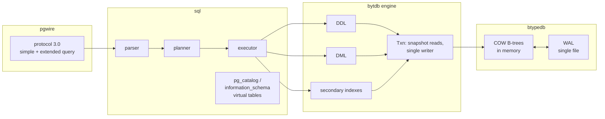
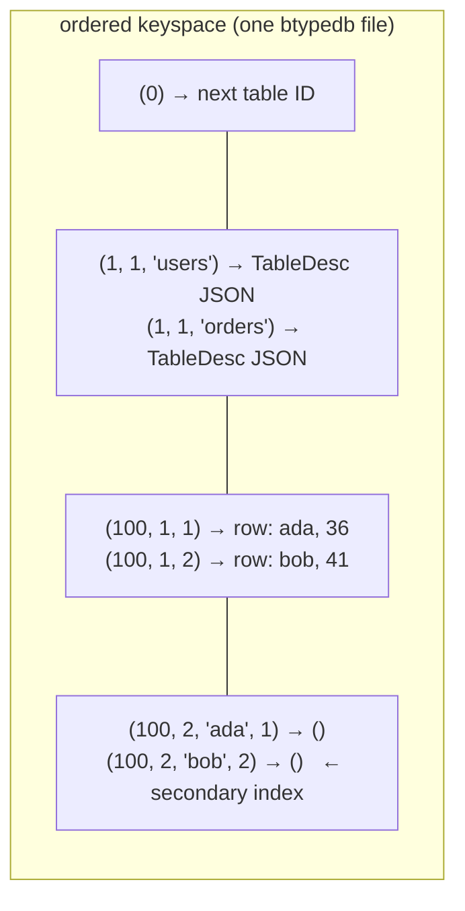
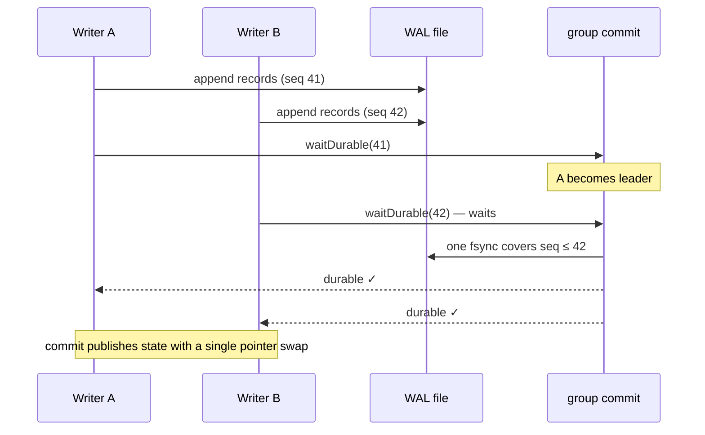
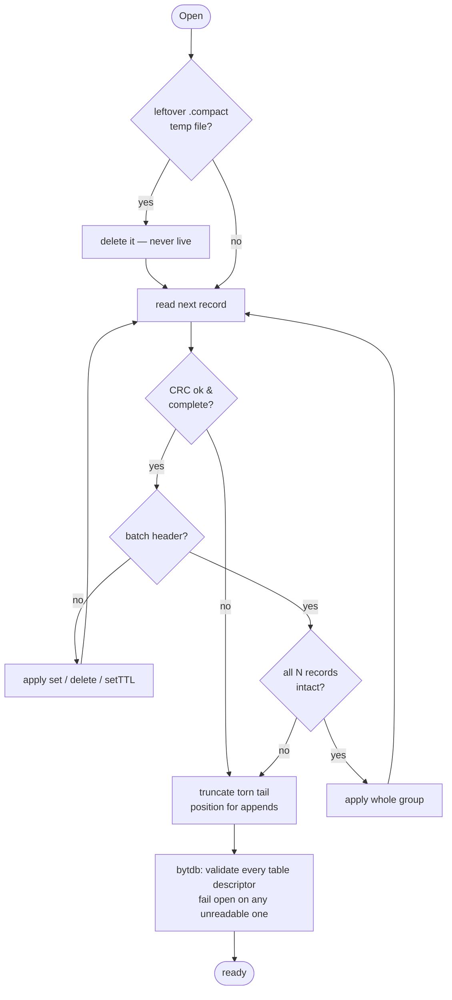
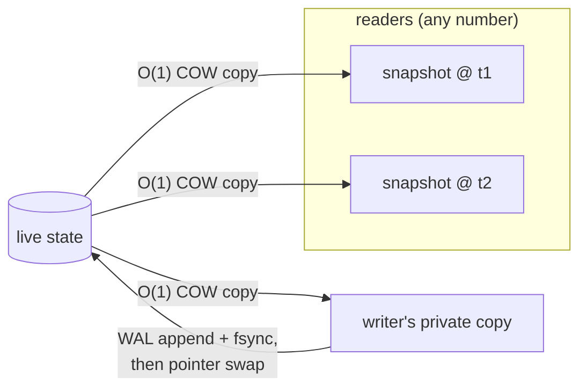
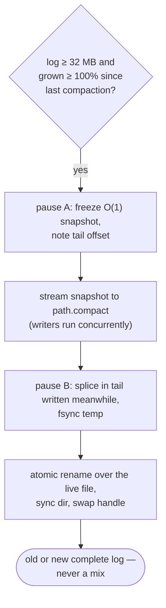
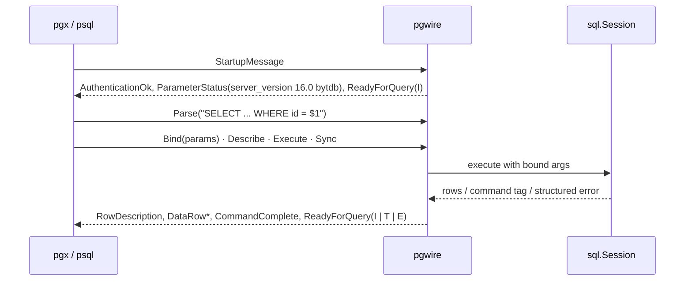

# Architecture

bytdb is four layers, each of which is useful on its own. The relational layer
(`bytdb`) turns tables into ordered key ranges; the SQL layer (`bytdb/sql`)
turns statements into engine calls; the wire layer (`bytdb/pgwire`) turns
Postgres clients into SQL-layer sessions; and everything bottoms out in
`btypedb`, an ordered key-value store with a write-ahead log.



## One ordered keyspace

Every row and every index entry is a key in a single ordered `btypedb` keyspace.
The [tuple](#tuple-encoding-the-load-bearing-trick) encoding preserves order, so
"scan the `users` table" and "range-scan an index" are both just ordered key scans:

```
tuple(tableID, indexID, pk...)  ->  tuple(non-pk columns as (colID, value) pairs)
```

System state lives at reserved table IDs — **the catalog is data**, stored in the
same keyspace it describes:

| Table ID | Contents |
|---|---|
| `0` | The table-ID sequence: a single key holding the next ID to allocate |
| `1` | Table descriptors: `(name) -> JSON TableDesc` |
| `2` | Sequences: named (`(name) -> uint64` next value, `seq.go`) and identity-column counters (`(tableID, colID) -> uint64`, `identity.go`), in separate index spaces |
| `100+` | User tables |

Because descriptors live in the kv keyspace, every transaction resolves schema
from **its own snapshot** — the schema a transaction sees is exactly the schema
of the data it sees, by construction. There is no separate in-memory catalog to
keep coherent; the only cache is a descriptor parse cache validated by blob
identity (`engine.go:186-211`). It also means DDL is transactional: a
`CREATE INDEX` backfill and its descriptor write commit or roll back as one
atomic kv transaction — an index exists complete, or not at all.



## Tuple encoding: the load-bearing trick

`bytdb/tuple` provides an order-preserving binary encoding:
`bytes.Compare(Encode(a), Encode(b)) == Compare(a, b)`. That single property is
what makes B-tree key scans implement relational scans.

- **Type tags** (persistent, never renumbered) give a total cross-type order:
  `NULL < false < true < ints < floats < bytes < strings`.
- **Ints** encode as big-endian uint64 with the sign bit flipped, so signed
  order survives byte comparison. **Floats** flip all bits when negative, set
  the top bit when positive.
- **Strings/bytes** escape `0x00` as `0x00 0xFF` and terminate with `0x00 0x01`,
  so `"a" < "a\x00" < "ab"` and encodings are prefix-free.
- **Descending index columns** XOR the ascending encoding with `0xFF` byte-for-byte,
  which exactly reverses order and stays self-delimiting — ascending and
  descending elements mix freely in one key (`tuple/tuple.go:67-73`).

## Storage engine: memory-resident, log-durable

`btypedb` keeps the entire dataset in memory as **copy-on-write B-trees**
(`tidwall/btype`, version-pinned) and makes it durable through a single
append-only WAL file. The in-memory state is four trees that always change
together (`state.go:54-59`):

- `data` — key → value
- `ttl` — key → expiry deadline
- `exp` — (deadline, key), earliest-first, for the expiry sweeper
- `idx` — registered runtime indexes

Copying all four is **O(1)** (COW tree copy), which is what makes snapshots,
transactions, and savepoints cheap.

### The write-ahead log

```
op    1 byte   (1=set, 2=delete, 3=batch header, 4=set with TTL)
klen  4 bytes  little-endian
vlen  4 bytes  little-endian
key   klen bytes
val   vlen bytes
crc   4 bytes  CRC-32 (IEEE) over op..val
```

A **batch header** (klen 0, vlen 8, val = op count) marks the next N records as
one atomic transaction: replay applies them all or discards the whole group.
A **set-with-TTL** record prefixes its value with the absolute expiry deadline
(8 bytes, unix nanos), so replay at any later time reconstructs the same
expiration.

### Commit path and group commit

Under the default `SyncAlways` policy, a commit is acknowledged only after its
bytes are fsynced — but concurrent committers coalesce into one fsync
(group commit): every append takes a sequence number, and the first committer
to arrive while no fsync is in flight becomes the leader and syncs once for
every append so far (`groupcommit.go:29-77`).



Three sync policies (`WithSyncPolicy`):

| Policy | Guarantee | Cost |
|---|---|---|
| `SyncAlways` (default) | Every acknowledged write is on disk | One (group) fsync per commit |
| `SyncEverySecond` | Lose at most ~1 s on power loss | Background ticker fsync |
| `SyncNever` | OS decides | None |

### Startup recovery

On `Open`, the file is replayed from the beginning into fresh trees. The first
torn or CRC-failing record marks the end of the valid log; everything past it
is truncated away. A batch torn partway through is discarded entirely, keeping
multi-op transactions atomic across a crash.



The relational layer adds one step: `loadCatalog` parses every table descriptor,
refusing to open on any unreadable or newer-format-version descriptor —
silently skipping one would hide that table's rows and let a re-`CREATE` reuse
key space an existing table owns (`engine.go:304-327`).

## Transactions

The concurrency model is **single writer, many lock-free readers**:

- A read transaction is an O(1) COW snapshot, frozen at `Begin`, and takes no
  locks while iterating.
- A write transaction holds the single writer lock for its lifetime and works
  on a **private copy** invisible to readers until commit.
- Commit appends the batch to the WAL, then publishes with a **single pointer
  swap** — data, TTLs, and indexes change atomically for every future snapshot.
- This is serializable isolation by construction (there is only ever one writer).



**Savepoints** are the same trick one level down: an O(1) snapshot of the
transaction's private state plus the pending-log length. `ROLLBACK TO` restores
both; savepoints nest, and rewinding destroys later ones — Postgres semantics.

**Reentrancy guard:** the writer lock is not reentrant, so a one-shot write or
DDL issued from the goroutine that already holds the open write transaction
would deadlock the entire engine forever. The engine tracks the writer's
goroutine ID and turns that programming error into an error return instead
(`engine.go:253-261`).

## Secondary indexes

Two entry shapes share one index key range (`index.go:12-21`):

| Form | Key | Value |
|---|---|---|
| Non-unique | `tuple(tableID, indexID, indexed..., pk...)` | empty |
| Unique | `tuple(tableID, indexID, indexed...)` | `tuple(pk...)` |

Uniqueness is enforced by key collision. A row with NULL in any indexed column
takes the **non-unique form even in a unique index**, so NULLs never conflict —
SQL semantics. Descending columns use the tuple `Desc` encoding; the PK suffix
always ascends. `CREATE INDEX` backfills, checks uniqueness, and writes the
descriptor in one atomic kv transaction.

## Compaction

There is no separate data file — **the WAL *is* the database file**. Every
write appends a record to one append-only log, and `Open` reconstructs the
in-memory trees by replaying it from the top. A file that only ever grows
accumulates dead weight: a key overwritten 100 times has 100 records but only
the last one matters, and deleted or expired keys still occupy space as stale
records.

**Compaction is what "resetting" or "snapshotting" the WAL means here.**
`Compact()` rewrites the log down to its minimal equivalent — one set-record
per live key (TTL deadlines preserved, already-expired keys dropped entirely) —
so the log doubles as a snapshot. There is no separate checkpoint file and no
in-place truncation: the snapshot lives as the head of the freshly rewritten
log, and replaying the new file reconstructs identical state. The rewrite
pauses writers only twice, briefly:



The compacted file is literally *snapshot + recent tail*: writers keep
appending to the live log while the snapshot streams, and pause B splices those
records onto the end of the temp file before the atomic rename swaps it into
place. A crash at any point leaves either the old complete log or the new one —
never a mix; a leftover `.compact` temp is discarded at next open, since it
only ever becomes live via the rename.

Auto-compaction runs in the background once the log is ≥ 32 MB **and** has
grown ≥ 100% past its post-last-compaction size — roughly whenever the log
doubles. Both thresholds are tunable, auto-compaction can be disabled, and
`Compact()` can be called manually at any time.

One design consequence: because compaction rewrites the entire live dataset,
its cost is proportional to **data size, not garbage size** — fine for the
single-file embedded use case, and the reason the growth-percentage trigger
exists (compact only when there's enough garbage to make the rewrite
worthwhile).

## TTL

`SetTTL` stores an absolute deadline alongside the value. Expiry is enforced
**lazily at read time** (an expired key reads as absent immediately), and a
background sweeper (every 500 ms, ≤512 keys per transaction) walks the
deadline-ordered `exp` tree to reclaim memory and log space. Deadlines survive
restart because they are absolute timestamps in the WAL record itself.

## The wire server

`pgwire` implements PostgreSQL protocol 3.0: simple query, and the full extended
flow (`Parse`/`Bind`/`Describe`/`Execute`/`Close`/`Sync`/`Flush`) with named
prepared statements and portals, text and binary formats for all five column
types, real transaction status in `ReadyForQuery`, structured errors with
Postgres SQLSTATEs and 1-based error positions, and an idle-in-transaction
timeout. Auth is trust; SSL/GSS are declined cleanly.



What makes ORMs work is less the protocol than the **system catalog emulation**:
`pg_class`, `pg_attribute`, `pg_type`, `pg_index`, `pg_constraint`,
`information_schema.tables`/`columns`, and a dozen more are synthesized
on the fly from table descriptors (`sql/syscat.go`), enough for `psql`'s `\dt`
and `\d`, GORM's `HasTable`, and SQLAlchemy/ActiveRecord introspection queries
to run verbatim.
