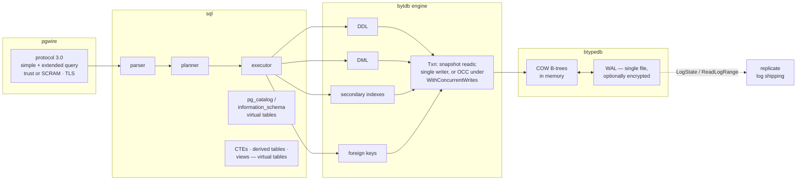
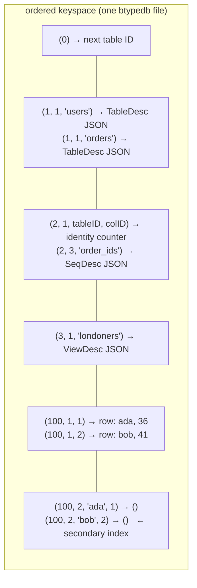
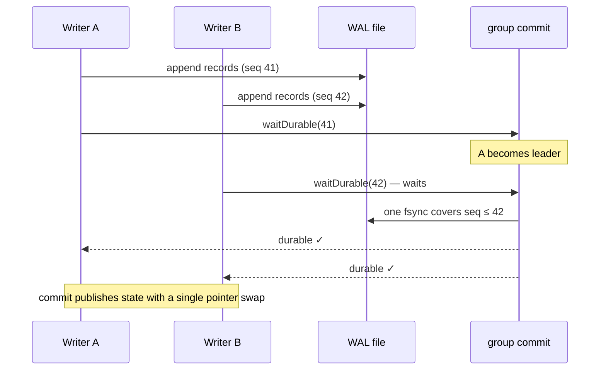
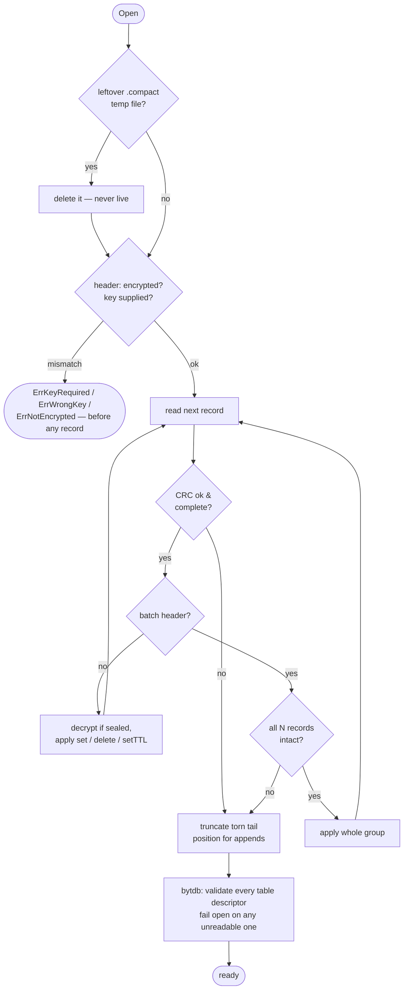
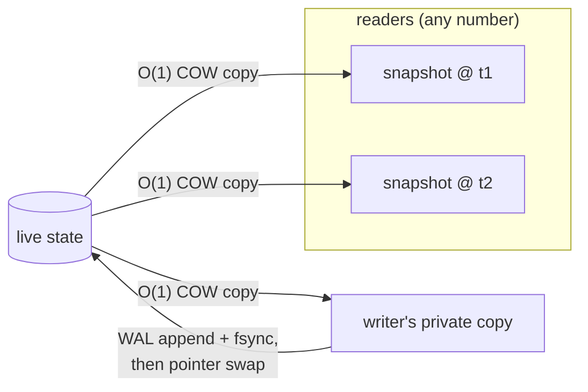
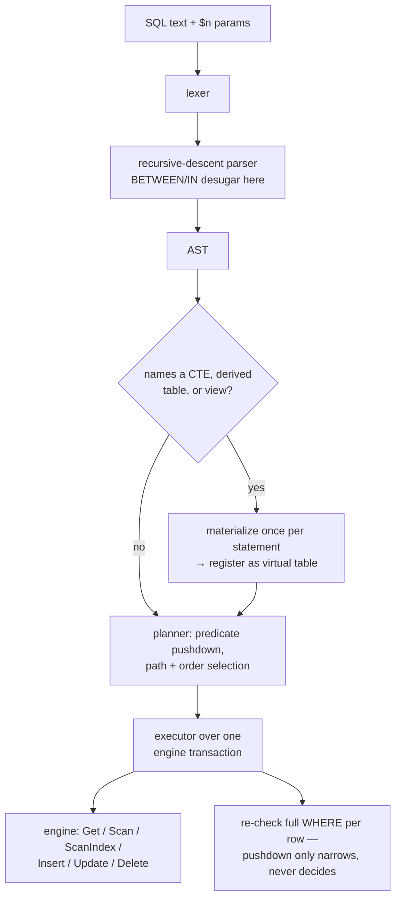
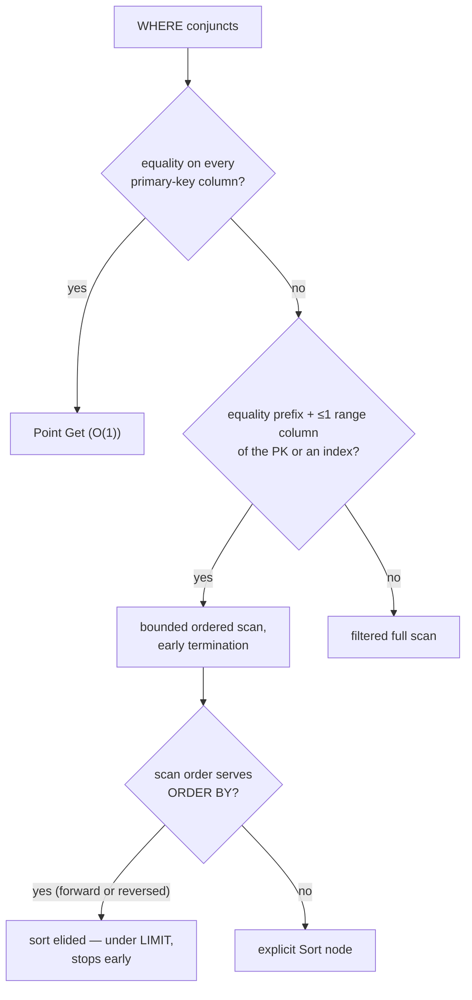
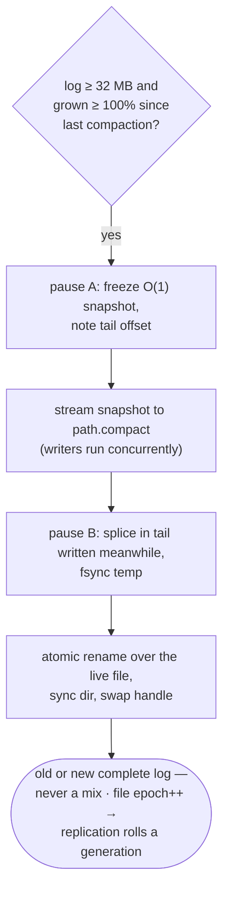
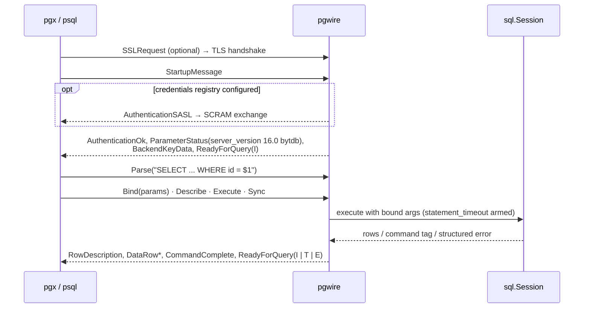

# Architecture

bytdb is four layers, each of which is useful on its own. The relational layer
(`bytdb`) turns tables into ordered key ranges; the SQL layer (`bytdb/sql`)
turns statements into engine calls; the wire layer (`bytdb/pgwire`) turns
Postgres clients into SQL-layer sessions; and everything bottoms out in
`btypedb`, an ordered key-value store with a write-ahead log. Two optional
pieces ride alongside: `bytdb/stdlib`, a `database/sql` driver that serves
the same SQL-layer sessions in-process ([its own page](stdlib.md)), and
`bytdb/replicate`, which tails the log to an object store
([its own page](replication.md)).


```mermaid
flowchart LR
    subgraph wire ["pgwire"]
        proto[protocol 3.0<br/>simple + extended query<br/>trust or SCRAM · TLS]
    end
    subgraph sqlpkg ["sql"]
        parse[parser] --> plan[planner] --> exec[executor]
        syscat[pg_catalog /<br/>information_schema<br/>virtual tables]
        vt[CTEs · derived tables ·<br/>views — virtual tables]
    end
    subgraph engine ["bytdb engine"]
        ddl[DDL] & dml[DML] & idx[secondary indexes] & fk[foreign keys] --> txn[Txn: snapshot reads;<br/>single writer, or OCC under<br/>WithConcurrentWrites]
    end
    subgraph kvstore ["btypedb"]
        cow[COW B-trees<br/>in memory] <--> wal[WAL — single file,<br/>optionally encrypted]
    end
    rep[replicate<br/>log shipping]
    proto --> parse
    exec --> ddl & dml & idx & fk
    txn --> cow
    wal -.->|LogState / ReadLogRange| rep
```

## One ordered keyspace

Every row and every index entry is a key in a single ordered `btypedb` keyspace.
The [tuple](#tuple-encoding-the-load-bearing-trick) encoding preserves order, so
"scan the `users` table" and "range-scan an index" are both just ordered key scans:

```
tuple(tableID, indexID, pk...)  ->  tuple(non-pk columns as (colID, value) pairs)
```

System state lives at reserved table IDs — **the catalog is data**, stored in the
same keyspace it describes:

| Table ID | Contents |
|---|---|
| `0` | The table-ID sequence: a single key holding the next ID to allocate |
| `1` | Table descriptors: `(name) -> JSON TableDesc` |
| `2` | Sequences, in separate index spaces: identity-column counters (`(tableID, colID) -> uint64`, `identity.go`) and standalone sequence objects (`(name) -> JSON SeqDesc`, `seqobj.go`) |
| `3` | Views: `(name) -> JSON ViewDesc` — a name bound to stored SELECT text (`view.go`) |
| `100+` | User tables |

Because descriptors live in the kv keyspace, every transaction resolves schema
from **its own snapshot** — the schema a transaction sees is exactly the schema
of the data it sees, by construction. There is no separate in-memory catalog to
keep coherent; the only cache is a descriptor parse cache validated by blob
identity (`engine.go`). It also means DDL is transactional: a
`CREATE INDEX` backfill and its descriptor write commit or roll back as one
atomic kv transaction — an index exists complete, or not at all.


```mermaid
flowchart TD
    subgraph keyspace ["ordered keyspace (one btypedb file)"]
        direction TB
        seq["(0) → next table ID"]
        desc["(1, 1, 'users') → TableDesc JSON<br/>(1, 1, 'orders') → TableDesc JSON"]
        seqs["(2, 1, tableID, colID) → identity counter<br/>(2, 3, 'order_ids') → SeqDesc JSON"]
        views["(3, 1, 'londoners') → ViewDesc JSON"]
        rows["(100, 1, 1) → row: ada, 36<br/>(100, 1, 2) → row: bob, 41"]
        idx2["(100, 2, 'ada', 1) → ()<br/>(100, 2, 'bob', 2) → ()   ← secondary index"]
    end
    seq --- desc --- seqs --- views --- rows --- idx2
```

## Tuple encoding: the load-bearing trick

`bytdb/tuple` provides an order-preserving binary encoding:
`bytes.Compare(Encode(a), Encode(b)) == Compare(a, b)`. That single property is
what makes B-tree key scans implement relational scans.

- **Type tags** (persistent, never renumbered) give a total cross-type order:
  `NULL < false < true < ints < floats < bytes < strings`.
- **Ints** encode as big-endian uint64 with the sign bit flipped, so signed
  order survives byte comparison. **Floats** flip all bits when negative, set
  the top bit when positive. Timestamps (µs) and dates (days) ride the int
  encoding, so time-typed keys order chronologically.
- **Strings/bytes** escape `0x00` as `0x00 0xFF` and terminate with `0x00 0x01`,
  so `"a" < "a\x00" < "ab"` and encodings are prefix-free.
- **Descending index columns** XOR the ascending encoding with `0xFF` byte-for-byte,
  which exactly reverses order and stays self-delimiting — ascending and
  descending elements mix freely in one key (`tuple/tuple.go`).

## Storage engine: memory-resident, log-durable

`btypedb` keeps the entire dataset in memory as **copy-on-write B-trees**
(`tidwall/btype`, version-pinned) and makes it durable through a single
append-only WAL file. The in-memory state is four trees that always change
together:

- `data` — key → value
- `ttl` — key → expiry deadline
- `exp` — (deadline, key), earliest-first, for the expiry sweeper
- `idx` — registered runtime indexes

Copying all four is **O(1)** (COW tree copy), which is what makes snapshots,
transactions, and savepoints cheap.

### The write-ahead log

```
op    1 byte   (1=set, 2=delete, 3=batch header, 4=set with TTL)
klen  4 bytes  little-endian
vlen  4 bytes  little-endian
key   klen bytes
val   vlen bytes
crc   4 bytes  CRC-32 (IEEE) over op..val
```

A **batch header** (klen 0, vlen 8, val = op count) marks the next N records as
one atomic transaction: replay applies them all or discards the whole group.
A **set-with-TTL** record prefixes its value with the absolute expiry deadline
(8 bytes, unix nanos), so replay at any later time reconstructs the same
expiration.

When the database is opened with `WithEncryptionKey`, each record's *value* is
sealed with AES-256-GCM while this framing (and the key bytes) stay cleartext —
so torn-tail detection and crash recovery need no key, and the CRC still
catches bit-rot. Details and diagrams on the
[Encryption & Security](security.md) page.

### Commit path and group commit

Under the default `SyncAlways` policy, a commit is acknowledged only after its
bytes are fsynced — but concurrent committers coalesce into one fsync
(group commit): every append takes a sequence number, and the first committer
to arrive while no fsync is in flight becomes the leader and syncs once for
every append so far.


```mermaid
sequenceDiagram
    participant W1 as Writer A
    participant W2 as Writer B
    participant WAL as WAL file
    participant GC as group commit
    W1->>WAL: append records (seq 41)
    W2->>WAL: append records (seq 42)
    W1->>GC: waitDurable(41)
    Note over GC: A becomes leader
    W2->>GC: waitDurable(42) — waits
    GC->>WAL: one fsync covers seq ≤ 42
    GC-->>W1: durable ✓
    GC-->>W2: durable ✓
    Note over W1,W2: commit publishes state with a single pointer swap
```

Three sync policies (`WithSyncPolicy`):

| Policy | Guarantee | Cost |
|---|---|---|
| `SyncAlways` (default) | Every acknowledged write is on disk | One (group) fsync per commit |
| `SyncEverySecond` | Lose at most ~1 s on power loss | Background ticker fsync |
| `SyncNever` | OS decides | None |

### Startup recovery

On `Open`, the file is replayed from the beginning into fresh trees. The first
torn or CRC-failing record marks the end of the valid log; everything past it
is truncated away. A batch torn partway through is discarded entirely, keeping
multi-op transactions atomic across a crash. Encrypted files reconcile the key
against the header *before* any record is read — a wrong key fails fast, never
mid-replay.


```mermaid
flowchart TD
    open([Open]) --> tmp{leftover .compact<br/>temp file?}
    tmp -- yes --> rm[delete it — never live] --> hdr
    tmp -- no --> hdr{header: encrypted?<br/>key supplied?}
    hdr -- mismatch --> keyerr([ErrKeyRequired / ErrWrongKey /<br/>ErrNotEncrypted — before any record])
    hdr -- ok --> read[read next record]
    read --> valid{CRC ok &<br/>complete?}
    valid -- no --> trunc[truncate torn tail<br/>position for appends] --> catalog
    valid -- yes --> batch{batch header?}
    batch -- no --> apply[decrypt if sealed,<br/>apply set / delete / setTTL] --> read
    batch -- yes --> group{all N records<br/>intact?}
    group -- yes --> applyAll[apply whole group] --> read
    group -- no --> trunc
    catalog[bytdb: validate every table descriptor<br/>fail open on any unreadable one] --> ready([ready])
```

The relational layer adds one step: `loadCatalog` parses every table descriptor,
refusing to open on any unreadable or newer-format-version descriptor —
silently skipping one would hide that table's rows and let a re-`CREATE` reuse
key space an existing table owns (`engine.go`).

## Transactions

The default concurrency model is **single writer, many lock-free readers**:

- A read transaction is an O(1) COW snapshot, frozen at `Begin`, and takes no
  locks while iterating.
- A write transaction holds the single writer lock for its lifetime and works
  on a **private copy** invisible to readers until commit.
- Commit appends the batch to the WAL, then publishes with a **single pointer
  swap** — data, TTLs, and indexes change atomically for every future snapshot.
- This is serializable isolation by construction (there is only ever one writer).

Opening with `bytdb.WithConcurrentWrites()` trades the writer lock for
optimistic concurrency control: write transactions overlap on private
snapshots, validate at commit (first committer wins, the loser retries), and
run at snapshot isolation with per-transaction opt-up to SERIALIZABLE. See
[Concurrency & Isolation](concurrency.md).


```mermaid
flowchart LR
    subgraph readers ["readers (any number)"]
        r1[snapshot @ t1] & r2[snapshot @ t2]
    end
    live[(live state)] -- "O(1) COW copy" --> r1 & r2
    live -- "O(1) COW copy" --> priv[writer's private copy]
    priv -- "WAL append + fsync,<br/>then pointer swap" --> live
```

**Savepoints** are the same trick one level down: an O(1) snapshot of the
transaction's private state plus the pending-log length. `ROLLBACK TO` restores
both; savepoints nest, and rewinding destroys later ones — Postgres semantics.

**Reentrancy guard:** the writer lock is not reentrant, so a one-shot write or
DDL issued from the goroutine that already holds the open write transaction
would deadlock the entire engine forever. The engine tracks the writer's
goroutine ID and turns that programming error into an error return instead
(`engine.go`).

## Secondary indexes

Two entry shapes share one index key range (`index.go`):

| Form | Key | Value |
|---|---|---|
| Non-unique | `tuple(tableID, indexID, indexed..., pk...)` | empty |
| Unique | `tuple(tableID, indexID, indexed...)` | `tuple(pk...)` |

Uniqueness is enforced by key collision. A row with NULL in any indexed column
takes the **non-unique form even in a unique index**, so NULLs never conflict —
SQL semantics. Descending columns use the tuple `Desc` encoding; the PK suffix
always ascends. `CREATE INDEX` backfills, checks uniqueness, and writes the
descriptor in one atomic kv transaction.

## Foreign keys

Foreign-key metadata lives in the table descriptor (`fk.go`); *enforcement*
lives in the SQL layer (`sql/fk.go`) and goes through the ordinary planner —
no dedicated machinery:

- A child INSERT/UPDATE probes for the referenced parent row (point get or
  bounded scan when the parent key is the PK or a unique index — which it must
  be, by rule).
- A parent DELETE/UPDATE checks for referencing children **at end of
  statement** — so deleting a parent and its children in one statement is
  legal — and `ON DELETE CASCADE` runs a transitive worklist that terminates
  through cycles and self-references. Cascaded rows never bypass a stricter
  NO ACTION constraint further down.
- Checks run inside the statement's transaction; a violation rolls the whole
  statement back with Postgres wording and SQLSTATE 23503.

Because the child-side probe is just a planned scan, an **unindexed FK column
means a child-table scan per parent-key check** — index your FK columns, as in
Postgres. Schema guards refuse to drop or rename anything a foreign key
depends on.

## The SQL layer

`bytdb/sql` is a hand-rolled pipeline with zero dependencies: lexer →
recursive-descent parser → planner → executor, plus a session layer for
transaction blocks and a virtual-table mechanism that serves the system
catalog, CTEs, derived tables, and views through one door.


```mermaid
flowchart TD
    txt[SQL text + $n params] --> lex[lexer] --> prs[recursive-descent parser<br/>BETWEEN/IN desugar here] --> ast[AST]
    ast --> vtabs{names a CTE, derived<br/>table, or view?}
    vtabs -- yes --> mat[materialize once per statement<br/>→ register as virtual table]
    vtabs -- no --> plnr
    mat --> plnr[planner: predicate pushdown,<br/>path + order selection]
    plnr --> ex[executor over one<br/>engine transaction]
    ex --> eng[engine: Get / Scan / ScanIndex /<br/>Insert / Update / Delete]
    ex --> chk[re-check full WHERE per row —<br/>pushdown only narrows, never decides]
```

### The planner's decision ladder

For each table access, using only predicates that are top-level `AND`
conjuncts (anything under `OR`/`NOT` stays filter-only):


```mermaid
flowchart TD
    q[WHERE conjuncts] --> pg{equality on every<br/>primary-key column?}
    pg -- yes --> point["Point Get (O(1))"]
    pg -- no --> pre{equality prefix + ≤1 range column<br/>of the PK or an index?}
    pre -- yes --> scan[bounded ordered scan,<br/>early termination]
    pre -- no --> full[filtered full scan]
    scan --> ord{scan order serves<br/>ORDER BY?}
    ord -- "yes (forward or reversed)" --> nosort[sort elided — under LIMIT,<br/>stops early]
    ord -- no --> sort[explicit Sort node]
```

Ties between equally-selective paths break toward the one whose order also
serves `ORDER BY`. The whole WHERE is re-checked row by row regardless, so
pushdown is purely an optimization — correctness never depends on it.

Join steps choose between index nested loop and hash join per step (decision
diagram on the [Features](features.md#joins) page); `EXPLAIN` prints the
Postgres-shaped plan tree (`Point Get`, `Index Scan [Backward]`, `Seq Scan`,
`Nested Loop`, `Hash Join`, `HashAggregate`, `WindowAgg`, `Sort`, `Unique`,
`Limit`, `Append`) without invented costs.

### Virtual tables: one mechanism, four users

CTEs, derived tables (desugared into synthetic CTEs at parse), persistent
views (stored SELECT text, materialized per statement), and the synthesized
`pg_catalog` / `information_schema` tables all register as in-memory virtual
tables and flow through the ordinary join/aggregate machinery. Joins against
them are hash joins automatically, since they can have no indexes.
`Prepare`/`Describe`/`EXPLAIN` resolve shapes statically without executing
anything.

## Compaction

There is no separate data file — **the WAL *is* the database file**. Every
write appends a record to one append-only log, and `Open` reconstructs the
in-memory trees by replaying it from the top. A file that only ever grows
accumulates dead weight: a key overwritten 100 times has 100 records but only
the last one matters, and deleted or expired keys still occupy space as stale
records.

**Compaction is what "resetting" or "snapshotting" the WAL means here.**
`Compact()` rewrites the log down to its minimal equivalent — one set-record
per live key (TTL deadlines preserved, already-expired keys dropped entirely) —
so the log doubles as a snapshot. There is no separate checkpoint file and no
in-place truncation: the snapshot lives as the head of the freshly rewritten
log, and replaying the new file reconstructs identical state. The rewrite
pauses writers only twice, briefly:


```mermaid
flowchart TD
    trigger{"log ≥ 32 MB and<br/>grown ≥ 100% since<br/>last compaction?"} -- yes --> p1
    p1["pause A: freeze O(1) snapshot,<br/>note tail offset"] --> stream["stream snapshot to path.compact<br/>(writers run concurrently)"]
    stream --> p2["pause B: splice in tail written meanwhile,<br/>fsync temp"] --> ren["atomic rename over the live file,<br/>sync dir, swap handle"]
    ren --> done([old or new complete log —<br/>never a mix · file epoch++ →<br/>replication rolls a generation])
```

The compacted file is literally *snapshot + recent tail*: writers keep
appending to the live log while the snapshot streams, and pause B splices those
records onto the end of the temp file before the atomic rename swaps it into
place. A crash at any point leaves either the old complete log or the new one —
never a mix; a leftover `.compact` temp is discarded at next open, since it
only ever becomes live via the rename. On an encrypted database, compaction
re-seals every record with a fresh nonce.

Auto-compaction runs in the background once the log is ≥ 32 MB **and** has
grown ≥ 100% past its post-last-compaction size — roughly whenever the log
doubles. Both thresholds are tunable, auto-compaction can be disabled, and
`Compact()` can be called manually at any time.

One design consequence: because compaction rewrites the entire live dataset,
its cost is proportional to **data size, not garbage size** — fine for the
single-file embedded use case, and the reason the growth-percentage trigger
exists (compact only when there's enough garbage to make the rewrite
worthwhile).

## Replication hooks

Because the log is append-only between compactions, replication needs only two
engine primitives: `LogState()` (the log's epoch and safe-to-ship size) and
`ReadLogRange(epoch, from, max, w)` (copy immutable bytes, holding off only
compaction). Compaction bumps the epoch, which tells a follower to restart
from offset zero. The full design — generations, manifests, restore — is on
the [Replication & Backup](replication.md) page.

## TTL

`SetTTL` stores an absolute deadline alongside the value. Expiry is enforced
**lazily at read time** (an expired key reads as absent immediately), and a
background sweeper (every 500 ms, ≤512 keys per transaction) walks the
deadline-ordered `exp` tree to reclaim memory and log space. Deadlines survive
restart because they are absolute timestamps in the WAL record itself.

## The wire server

`pgwire` implements PostgreSQL protocol 3.0: simple query, and the full extended
flow (`Parse`/`Bind`/`Describe`/`Execute`/`Close`/`Sync`/`Flush`) with named
prepared statements and portals, text and binary formats for every column
type, real transaction status in `ReadyForQuery`, structured errors with
Postgres SQLSTATEs and 1-based error positions, out-of-band query cancellation
via real `BackendKeyData`, and a stack of timeouts (statement,
idle-in-transaction, idle session, startup, I/O) plus connection caps and
per-connection panic fences. Auth is trust by default or SCRAM-SHA-256(-PLUS),
with TLS via the standard `SSLRequest` upgrade — details on the
[Encryption & Security](security.md) page.


```mermaid
sequenceDiagram
    participant C as pgx / psql
    participant S as pgwire
    participant Q as sql.Session
    C->>S: SSLRequest (optional) → TLS handshake
    C->>S: StartupMessage
    opt credentials registry configured
        S-->>C: AuthenticationSASL → SCRAM exchange
    end
    S-->>C: AuthenticationOk, ParameterStatus(server_version 16.0 bytdb),<br/>BackendKeyData, ReadyForQuery(I)
    C->>S: Parse("SELECT ... WHERE id = $1")
    C->>S: Bind(params) · Describe · Execute · Sync
    S->>Q: execute with bound args (statement_timeout armed)
    Q-->>S: rows / command tag / structured error
    S-->>C: RowDescription, DataRow*, CommandComplete, ReadyForQuery(I | T | E)
```

What makes ORMs work is less the protocol than the **system catalog emulation**:
`pg_class` (tables, indexes, sequences, and views), `pg_attribute`,
`pg_attrdef`, `pg_type`, `pg_index`, `pg_constraint` (checks and foreign
keys), `pg_sequence`, `pg_stat_activity`, `information_schema.tables` /
`columns` / `sequences`, and a dozen more are synthesized on the fly from
table descriptors (`sql/syscat.go`), enough for `psql`'s `\dt` and `\d`,
GORM's `HasTable`, and SQLAlchemy/ActiveRecord introspection queries to run
verbatim.
