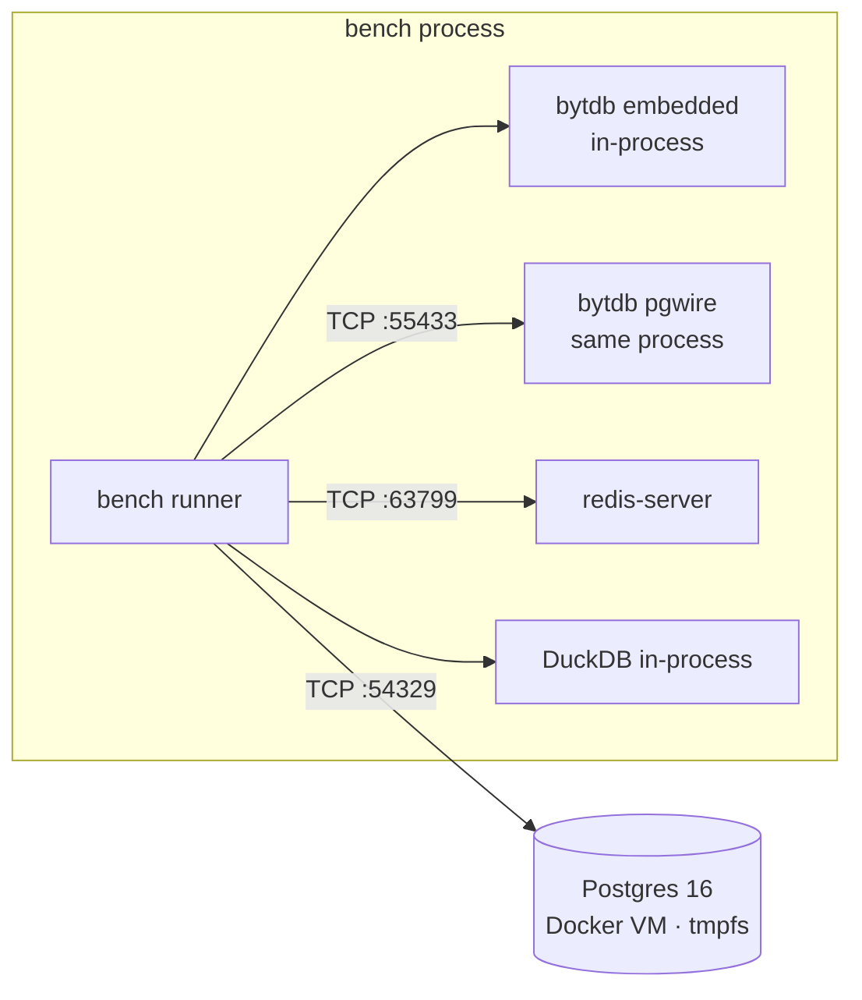

# Benchmarks

How does bytdb compare to an in-memory PostgreSQL, DuckDB, and Redis? The
short version: **for point operations, embedded bytdb is the fastest thing
here by an order of magnitude — because there is no wire.** Over its own
Postgres protocol it is competitive with Redis and several times faster than
Dockerized Postgres. For analytical scans, DuckDB is in a different league,
by design.

Numbers below are real, from the harness in `bench/` — not synthetic claims.
Rerun them yourself with `bench/run.sh`.

## Results

Latency per operation (lower is better), single client, sequential:

| Target | insert (durable single row) | insert (batched ×1000) | point read | point update | full-scan aggregate (100k rows) |
|---|---:|---:|---:|---:|---:|
| **bytdb** embedded, `SyncAlways` | 4,221.6 µs | 6.5 µs/row | **4.2 µs** | 4,571.4 µs | 31.2 ms |
| **bytdb** embedded, `SyncEverySecond` | **16.8 µs** | **1.9 µs/row** | **4.0 µs** | **22.8 µs** | 30.6 ms |
| **bytdb** over pgwire (TCP loopback) | 50.9 µs | 2.0 µs/row | 35.9 µs | 60.4 µs | 31.0 ms |
| **PostgreSQL 16** (Docker, data dir on tmpfs) | 173.8 µs | 3.4 µs/row | 199.6 µs | 212.3 µs | 4.8 ms |
| **DuckDB** (in-memory, Go driver) | 161.2 µs | 6.3 µs/row | 76.2 µs | 118.0 µs | **0.39 ms** |
| **Redis 7** (local server, RDB persistence) | 31.2 µs | 1.2 µs/row | 30.4 µs | 29.1 µs | n/a — no SQL |

Same data as throughput, for the ops/sec-minded:

| Target | durable single inserts | batched insert rows/s | point reads |
|---|---:|---:|---:|
| bytdb embedded, `SyncAlways` | 237/s | 154k/s | 238k/s |
| bytdb embedded, `SyncEverySecond` | 59.5k/s | 526k/s | 250k/s |
| bytdb over pgwire | 19.6k/s | 500k/s | 27.9k/s |
| PostgreSQL 16 (tmpfs) | 5.8k/s | 294k/s | 5.0k/s |
| DuckDB (in-memory) | 6.2k/s | 159k/s | 13.1k/s |
| Redis 7 | 32.1k/s | 833k/s | 32.9k/s |

## Read the durability column first

These systems are **not offering the same guarantee**, and that dominates the
single-insert column:

| Target | If the machine loses power right after an acknowledged write... |
|---|---|
| bytdb `SyncAlways` | **Nothing is lost.** Every ack means fsynced (macOS `F_FULLFSYNC` here — the honest, expensive kind). |
| bytdb `SyncEverySecond` | Up to ~1 s of writes lost; file always recovers to a consistent transaction boundary. |
| Postgres on tmpfs | **The entire database is gone** — tmpfs is RAM. "In-memory Postgres" trades away all durability. |
| DuckDB in-memory | The entire database is gone. |
| Redis (default RDB) | Everything since the last RDB snapshot is gone (minutes). |

So the one configuration in this lineup that survives a power cut is bytdb
`SyncAlways` — at 4.2 ms per solo commit on a Mac (Apple's `F_FULLFSYNC`
pushes through the drive cache; Postgres doing genuinely durable commits on
this hardware would pay the same price). Batching amortizes it: 1,000-row
transactions bring `SyncAlways` down to 6.5 µs/row. And group commit means
concurrent writers share one fsync — the 4.2 ms is a *solo* worst case.

## What the numbers say

**Point reads: embedded beats every server, ~7× faster than Redis.**
4 µs vs 30 µs is not bytdb out-engineering Redis — it is the absence of a
network round-trip, protocol encode/decode, and syscalls. That is the embedded
value proposition in one number. The same query through bytdb's own wire
protocol costs 36 µs — right in Redis territory, ~5× faster than the
Dockerized Postgres.

**Writes without per-commit fsync: bytdb leads.** At `SyncEverySecond`
(a stronger guarantee than Redis's default), embedded single-row inserts run
at 17 µs vs Redis's 31 µs and tmpfs-Postgres's 174 µs.

**Analytical scans: DuckDB wins by 80×, as it should.** `SELECT count(*),
sum(amount)` over 100k rows: DuckDB 0.39 ms (columnar, vectorized), Postgres
4.8 ms, bytdb 31 ms. bytdb executes row-at-a-time over a B-tree with
interpreted expressions and no parallelism. If your workload is scanning
millions of rows to aggregate, use DuckDB — or feed it from bytdb.

**The wire tax is visible and honest.** Embedded 4 µs → pgwire 36 µs for the
identical query on the identical engine: ~30 µs is what TCP loopback plus
Postgres protocol framing costs anyone.

## Methodology

- **Harness**: `bench/main.go` — one process, one connection/session, one
  operation in flight (latency measurement, not saturation throughput).
  Prepared statements for point ops everywhere; batch inserts as literal
  1,000-row `INSERT ... VALUES` statements for all SQL systems, pipelines of
  1,000 `SET`s for Redis.
- **Workloads**: 5,000 single-row autocommit inserts · 100,000 rows batch-inserted
  · 20,000 random point reads by PK · 5,000 random point updates · 20 repetitions
  of `count(*)+sum` over the 100k rows. Fixed RNG seed.
- **Schema**: `(id INT PRIMARY KEY, name TEXT, amount FLOAT)`; Redis stores the
  same payload as `SET k:<id> "<name>|<amount>"`.
- **Environment**: Apple M1 Pro, 16 GB, macOS 26.5.1, Go 1.26.1. PostgreSQL
  16.14 (`postgres:16-alpine`, Docker VM, `PGDATA` on tmpfs, stock config).
  DuckDB via `go-duckdb` v2.3.5. Redis 7.0.0 local, `--save '' --appendonly no`.
  bytdb WAL on the local SSD (APFS).



### Caveats, freely admitted

- Micro-benchmark: tiny rows, uniform access, no concurrency, no contention.
  Concurrent writers would shift things (bytdb serializes writers; Postgres
  runs them in parallel — with real fsync each, plus group commit of its own).
- Postgres pays a Docker-VM network hop on macOS that the others don't;
  on Linux bare metal expect its point-op numbers to improve severalfold
  (and bytdb `SyncAlways` inserts too — Linux `fsync` is far cheaper than
  macOS `F_FULLFSYNC`).
- Each system runs its stock configuration; all are tunable.
- 100k-row scans fit any cache; this says nothing about datasets larger than
  RAM — which bytdb does not support anyway ([Gotchas](gotchas.md)).

## Reproducing

```sh
cd bench
./run.sh          # needs Docker, redis-server, Go; writes results.json
```

The harness prints the markdown table above; `results.json` carries the raw
µs/op per workload.
