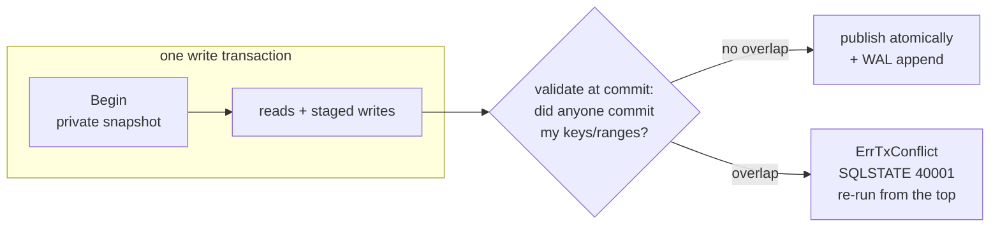

# Concurrency & Isolation

bytdb has two write modes, chosen once at `Open`:

- **Default (single writer).** Writable transactions run one at a time behind a
  writer lock. Isolation is trivially **SERIALIZABLE**, conflicts cannot
  happen, and sequence draws roll back with their transaction. Reads never
  block: they run on immutable snapshots in every mode.
- **Concurrent writes** (`bytdb.WithConcurrentWrites()`). Write transactions
  run concurrently under **optimistic concurrency control**: each executes
  against its own snapshot and validates at commit — first committer wins,
  the loser's commit fails with a retryable conflict. Isolation is **snapshot
  isolation** (Postgres `REPEATABLE READ` in spirit), with per-transaction
  opt-up to SERIALIZABLE.



```go
e, _ := bytdb.Open("app.db", bytdb.WithConcurrentWrites())
```

## What conflicts, and who retries

A conflict means: between your `Begin` and your `Commit`, another transaction
committed a key (or a range overlapping a range you deleted or — if
serializable — read) that you touched. It surfaces as `bytdb.ErrTxConflict`
embedded, and as SQLSTATE **40001** (`serialization_failure`) over the wire,
with Postgres's message and hint:

```
ERROR:  could not serialize access due to concurrent update
HINT:  The transaction might succeed if retried.
```

Who retries is a contract, not an accident:

| Statement shape | Retried by |
|---|---|
| Autocommit statement (no `BEGIN`) | The server, up to 3 times, silently — the statement is fully replayable because no intermediate result ever reached the client. Only then does 40001 surface. |
| `BEGIN … COMMIT` block | **Never retried server-side.** The client saw the block's reads, so only the client can decide to re-run it. 40001 surfaces at the losing statement — in practice, `COMMIT`. |
| Embedded `Engine` one-shot writes and `WriteTxn` | The caller. Wrap in a loop on `errors.Is(err, bytdb.ErrTxConflict)`; the closure re-runs from a fresh snapshot. |
| DDL | Nobody needs to: schema changes serialize internally and always make progress (see below). |

A client-side retry loop over the wire is the standard Postgres shape:

```go
for {
    err := runMyTransaction(conn) // BEGIN … COMMIT
    var pge *pgconn.PgError
    if errors.As(err, &pge) && pge.Code == "40001" {
        continue // re-run from the top
    }
    return err
}
```

## Opting up to SERIALIZABLE

Snapshot isolation admits **write skew** and **phantoms**: two transactions
each read what the other writes, write disjoint keys, and both commit — a
result no serial order could produce. Opting a transaction up to SERIALIZABLE
adds its *reads* (point gets, scan ranges, index probes) to commit validation,
so it commits only if it could have run alone. The cost is a higher conflict
rate, which is why it is per-transaction, as in Postgres.

Embedded:

```go
err := e.WriteTxnSerializable(func(tx *bytdb.Txn) error {
    // reads here are validated at commit
    return tx.Update("accounts", []any{id}, map[string]any{"bal": newBal})
})
// or, for externally driven boundaries: e.BeginSerializable()
```

SQL — any of the Postgres spellings:

```sql
BEGIN ISOLATION LEVEL SERIALIZABLE;

BEGIN;
SET TRANSACTION ISOLATION LEVEL SERIALIZABLE;  -- before the block's first query

SET SESSION CHARACTERISTICS AS TRANSACTION ISOLATION LEVEL SERIALIZABLE;
SET default_transaction_isolation = 'serializable';  -- session default
```

Semantics to know:

- `SET TRANSACTION` must precede the block's first query (Postgres's own
  rule, SQLSTATE 25001 otherwise): the upgrade works by tracking reads from
  that point on, so reads already taken would escape validation.
- The guarantee spans the transactions that ask for it. A snapshot-isolation
  transaction racing a serializable one can still write-skew — exactly as in
  Postgres.
- With the session default set to serializable, **autocommit statements run
  serializable too** — two overlapping single statements can write-skew just
  like two blocks.
- Read-only serializable transactions always commit.
- Weaker levels (`READ COMMITTED`, `REPEATABLE READ`) are accepted and get
  the engine's default, which is at least as strong as what was asked for.
- `SHOW transaction_isolation` reports reality: `repeatable read` under
  concurrent writes by default, `serializable` in the single-writer mode or
  inside an opted-up transaction.

## Sequences and identity under concurrent writes

`WithConcurrentWrites` also switches sequence and identity allocation to
Postgres semantics: draws are **non-transactional and gap-tolerant**. Values
drawn by an aborted or retried transaction are burned, and `setval` takes
effect immediately rather than at commit. Without this trade, every concurrent
insert into one table would collide on its counter key and OCC would buy
nothing. In the default mode allocation stays transactional and
gapless-on-rollback.

## DDL

Schema changes never run inside a transaction block in either mode. Under
concurrent writes, a DDL statement first tries optimistically (its commit
requires that *no* other commit landed — an index backfill depends on every
row of its snapshot, which per-key validation cannot express), then escalates
to a brief exclusive stall that cannot lose. Two consequences:

- DDL always makes progress, even under sustained write load, and never
  returns 40001.
- Every transaction in flight across a DDL commit conflicts and retries —
  autocommit statements absorb that silently; blocks see 40001 once.

## Choosing a mode

Stay with the default when writes are occasional or naturally serial: it is
simpler, gapless, and already serializable. Reach for `WithConcurrentWrites`
when independent writers contend — the Stage 2/3 benchmarks measured ~2.3–2.8×
on an 8-writer mixed workload (snapshot isolation 53.6µs/txn, serializable
66µs, single-writer 150µs). Hot single rows are the worst case for optimism:
if a counter row thrashes even through the built-in retries, restructure the
write (accumulate deltas, shard the counter) rather than spinning on 40001.
