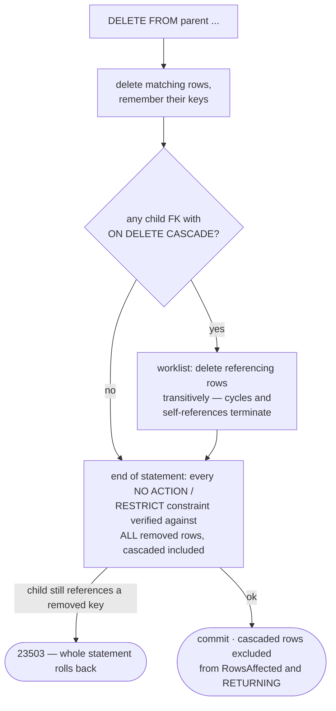
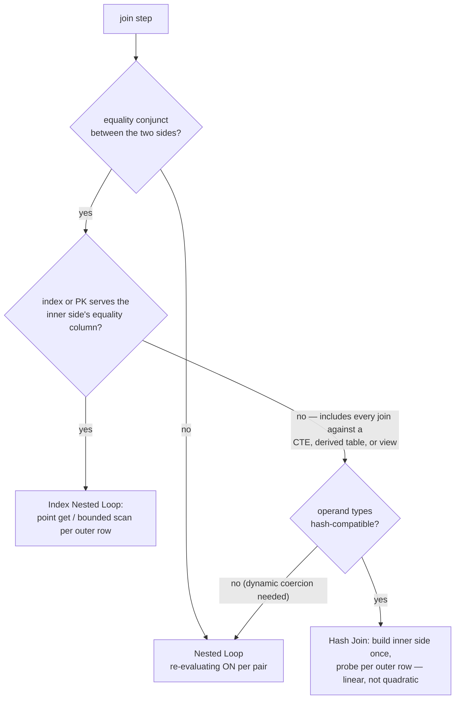

# Features & Examples

Every example on this page is verified by a test in the repository — file
references point at the proof.

## Column types

Ten storage types, with the Postgres aliases you'd expect
(`sql/parser.go`, `typeName`):

| Declared as | Stored as | Notes |
|---|---|---|
| `INT`, `INTEGER`, `BIGINT`, `INT2/4/8`, `SMALLINT` | `int64` | |
| `FLOAT`, `FLOAT4/8`, `REAL`, `DOUBLE PRECISION` | `float64` | `numeric` casts land here — there is no decimal type |
| `TEXT`, `STRING`, `VARCHAR(n)` | `string` | the `(n)` limit is **enforced** on every write, Postgres wording, SQLSTATE 22001 |
| `BOOL`, `BOOLEAN` | `bool` | |
| `BYTEA`, `BYTES` | `[]byte` | |
| `TIMESTAMP`, `TIMESTAMPTZ` | `int64` µs since epoch, UTC | one type: the `WITH/WITHOUT TIME ZONE` distinction parses and folds away; presents as `timestamptz` on the wire |
| `DATE` | `int64` days since epoch | |
| `UUID` | 16 bytes | dashed or 32-hex input; lowercase dashed output; `gen_random_uuid()` |
| `JSONB` (`JSON` is an alias) | canonical document text | compact, keys sorted — one spelling per document, so `=` is document equality |
| `TEXT[]` (`VARCHAR[]`) | canonical Postgres array-literal text | one-dimensional; OID 1009 in both wire formats |

Timestamp, date, and uuid values order chronologically/bytewise in keys and
indexes, so they work as primary-key and index columns with correct range
scans. `now()`, `transaction_timestamp()`, `statement_timestamp()`,
`clock_timestamp()`, `current_timestamp`, `current_date`, and
`gen_random_uuid()` all evaluate for real.
*(verified in `sql/datetime_uuid_test.go`)*

There is deliberately **no** decimal/numeric type, no time-of-day type, and no
array element type other than text — see [Gotchas](gotchas.md).

## Tables and constraints

```sql
CREATE TABLE items (
    id    INT PRIMARY KEY,
    sku   VARCHAR(12) UNIQUE,            -- sugar for a unique index
    price INT CHECK (price > 0),
    qty   INT,
    tag   TEXT DEFAULT 'new',
    added TIMESTAMP DEFAULT now(),
    CONSTRAINT qty_sane CHECK (qty >= 0 AND qty <= 100),
    UNIQUE (price, tag),
    CHECK (price * qty < 10000)
)
```
*(verified in `sql/sql_test.go`, `sql/default_test.go`)*

- Composite primary keys: `PRIMARY KEY (a, b)`.
- `NOT NULL` columns; NULL rejected with Postgres-worded errors (SQLSTATE 23502).
- `UNIQUE` column and table constraints are sugar for a unique index named
  `table_cols_key`, as in Postgres.
- `CHECK` constraints, column-level or table-level, named or auto-named,
  enforced on INSERT and UPDATE with Postgres wording:
  `new row for relation "items" violates check constraint "items_price_check"`
  (SQLSTATE 23514). `BETWEEN` works inside them.
- `ALTER TABLE t ADD COLUMN c type` — **O(1)**: no rows are rewritten; existing
  rows read the new column as NULL.
- `ALTER TABLE t DROP COLUMN c` — also O(1); data stays under a retired column
  ID and is skipped on decode.
- `ALTER TABLE t ADD CONSTRAINT n CHECK (...)` validates existing rows;
  `DROP CONSTRAINT [IF EXISTS] n`.
- `ALTER TABLE t RENAME TO t2` and `RENAME [COLUMN] c TO c2` are
  descriptor-only (rows are keyed by IDs, so indexes and identity counters
  follow); renames that would break a foreign key or a CHECK are refused.
  `ALTER TABLE t OWNER TO role` is accepted as a no-op — bytdb has no roles —
  so pg_dump/goose DDL runs unmodified. *(verified in `sql/rename_test.go`,
  `sql/owner_test.go`)*
- **`DEFAULT` values** are constant literals *plus exactly the clock markers*:
  `DEFAULT now()` (all `CURRENT_TIMESTAMP`-family spellings normalize to it)
  and `DEFAULT current_date`, evaluated once per INSERT statement so a
  multi-row insert stamps every row with the same instant. Applied when a
  column-list insert omits the column, as the `DEFAULT` keyword in `VALUES`,
  and via `INSERT ... DEFAULT VALUES`. General expression defaults stay
  rejected; `ADD COLUMN ... DEFAULT` needs an empty table (no backfill).
  *(verified in `sql/default_test.go`)*
- Defaults surface in the catalog — `pg_attrdef` rows (with `pg_get_expr` and
  `pg_attribute.atthasdef`) and `information_schema.columns.column_default` —
  so psql's `\d` renders the Default column and ORMs introspect them; identity
  columns report via `attidentity = 'd'` instead, as in Postgres.
  *(verified in `sql/attrdef_test.go`)*

## Foreign keys

```sql
CREATE TABLE users  (id INT PRIMARY KEY, name TEXT);
CREATE TABLE orders (
    id      INT PRIMARY KEY,
    user_id INT REFERENCES users,                    -- parent PK implied
    note    TEXT
);
-- named, explicit columns, cascade:
CREATE TABLE lines (
    id       INT PRIMARY KEY,
    order_id INT CONSTRAINT lines_order_fk
             REFERENCES orders (id) ON DELETE CASCADE
);
-- table-level composite, and added later:
ALTER TABLE child ADD CONSTRAINT child_p_fkey
    FOREIGN KEY (a, b) REFERENCES parent (x, y);
ALTER TABLE child DROP CONSTRAINT IF EXISTS child_p_fkey;
```
*(verified in `sql/fk_test.go`, `sql/fk_cascade_test.go`, and over the wire in
`pgwire/operability_test.go`)*

- Semantics are **MATCH SIMPLE**: a child INSERT/UPDATE requires the
  referenced parent row to exist; any NULL in the FK columns satisfies the
  constraint. The referenced columns must be the parent's primary key or a
  unique index's columns (Postgres wording otherwise). Child and parent
  column types must match exactly.
- `ON DELETE NO ACTION` / `RESTRICT` refuse a parent DELETE while children
  reference it. **`ON DELETE CASCADE`** removes referencing rows transitively
  instead. `ON UPDATE CASCADE` and `SET NULL/DEFAULT` are rejected at parse
  rather than silently weakened.
- Checks run at **end of statement**, so deleting a parent together with its
  children in one statement is legal, and a self-referencing row
  (`INSERT INTO forest VALUES (1, 1)`) inserts fine.
- Cascaded rows do **not** count toward `RowsAffected` or `RETURNING`, and a
  NO ACTION constraint further down still blocks the whole statement — as in
  Postgres. Violations carry Postgres's wording,
  `Key (user_id)=(9) is not present in table "users"` detail, and SQLSTATE
  23503.
- `ALTER TABLE ADD FOREIGN KEY` validates every existing row in the
  transaction that publishes the constraint — as two scans (parent keys
  materialize into a set), not a probe per row.
- Schema guards: you cannot drop a referenced table, drop an FK column, drop
  the unique index an FK depends on, or rename a referenced table out from
  under its children.

How a parent DELETE resolves:



!!! note "Index your FK columns"
    Enforcement goes through the ordinary planner: with an index (or PK) on
    the child FK columns, each check is a point get or bounded scan; without
    one, a parent DELETE/UPDATE scans the child table. Same advice as
    Postgres, for the same reason.

## Auto-increment

```sql
CREATE TABLE users (id SERIAL PRIMARY KEY, name TEXT);
-- or, spelled out:
CREATE TABLE t (id INT GENERATED BY DEFAULT AS IDENTITY PRIMARY KEY, v TEXT);

INSERT INTO users (name) VALUES ('ada'), ('grace');  -- ids 1, 2
INSERT INTO users VALUES (10, 'alan');               -- explicit id
INSERT INTO users (name) VALUES ('edsger');          -- id 11, no collision
```
*(verified in `sql/identity_test.go`)*

- `SERIAL` / `BIGSERIAL` / `SMALLSERIAL` (and `SERIAL2/4/8`) are sugar for an
  int identity column, `NOT NULL` included, as in Postgres.
- Each identity column owns a durable counter starting at 1. Omitting the
  column (or inserting NULL) draws the next value; an explicit value inserts
  as given and **bumps the counter past itself**, so later draws never
  collide — MySQL's semantics, deliberately: it removes Postgres's classic
  duplicate-key-after-restore footgun.
- `GENERATED ALWAYS AS IDENTITY` is rejected with a clear error: it promises
  a restriction (no explicit inserts) that isn't enforced.
- Identity implies NOT NULL; `information_schema.columns` reports the column
  non-nullable with a serial-style `column_default`, which is what
  introspecting ORMs key "omit on insert" off.
- `lastval()` and `currval('t_col_seq')` read back this session's identity
  draws (the probe some drivers send instead of `RETURNING`), with Postgres's
  55000 "not yet defined in this session" before the first draw. Draws are
  session-local and survive a rolled-back block, as in Postgres.
  *(verified in `sql/seqfuncs_test.go`)*

## Sequences

Standalone sequences with the Postgres option set:

```sql
CREATE SEQUENCE order_ids START WITH 1000 INCREMENT BY 10;
SELECT nextval('order_ids');          -- 1000; runs in a write txn under the covers
SELECT nextval('order_ids'::regclass); -- 1010; the spelling drivers use
SELECT setval('order_ids', 5000);      -- reposition (5000 counts as returned)
SELECT currval('order_ids'), lastval();
ALTER SEQUENCE order_ids RESTART WITH 1;
SELECT last_value, is_called FROM order_ids;  -- the one-row state relation
DROP SEQUENCE IF EXISTS order_ids;
```
*(verified in `sql/sequence_test.go`)*

- Options: `AS smallint|integer|bigint` (bounds the declarable range),
  `INCREMENT [BY]` (negative descends), `MINVALUE`/`MAXVALUE`/`NO
  MINVALUE`/`NO MAXVALUE`, `START [WITH]`, `CYCLE`/`NO CYCLE`, `CACHE n`
  (stored and reported; allocation behaves as `CACHE 1` — the engine has a
  single writer, so batching would only manufacture gaps), `IF [NOT]
  EXISTS` with Postgres' skip notices. Exhaustion, bounds, and option
  validation carry Postgres' wording (`nextval: reached maximum value of
  sequence "s" (20)`).
- Sequences share the relation namespace with tables and views, and appear in
  `pg_class` (relkind `'S'`), `pg_catalog.pg_sequence`, and
  `information_schema.sequences`; each also reads as its own one-row state
  relation, so `\ds` and driver probes work.
- `nextval` works directly in an INSERT — `VALUES (nextval('order_ids'),
  ...)` — since VALUES entries are full expressions. Allocation is
  transactional — see
  [Considerations & Gotchas](gotchas.md#sql-that-is-deliberately-not-there)
  for the two deliberate divergences from Postgres.

## RETURNING

```sql
INSERT INTO users (name) VALUES ('ada') RETURNING id;         -- the ORM idiom
INSERT INTO users (name) VALUES ('x'), ('y') RETURNING *;
UPDATE users SET age = age + 1 WHERE id = 1 RETURNING id, age;
DELETE FROM users WHERE city = 'nyc' RETURNING id, name AS gone;
```
*(verified in `sql/returning_test.go` and `pgwire/returning_test.go`)*

- INSERT and UPDATE report each row **as stored** — a `SERIAL` column's drawn
  value, coerced values, SET applied — straight from the engine, so the client
  learns server-generated IDs without a second round trip. DELETE reports the
  row as it was before removal.
- The clause is a full select list: expressions, aliases, `*`, `t.*`, and `$n`
  placeholders. Aggregates and window functions are rejected at parse, as in
  Postgres — each affected row yields exactly one output row.
- Works over both wire protocol paths: `Describe` announces the row shape
  before execution, and the command tag still carries the affected count
  (`INSERT 0 2` alongside the rows).
- Embedded callers get the same without SQL: `Engine.InsertReturning` /
  `Txn.InsertReturning` / `Txn.UpdateReturning` return the stored `Row`
  (verified in `returning_test.go`).

## Upsert (ON CONFLICT)

```sql
-- the counter idiom
INSERT INTO kv VALUES ('a', 1, 1)
    ON CONFLICT (k) DO UPDATE SET v = excluded.v, hits = kv.hits + 1
    RETURNING hits;

INSERT INTO t VALUES (1, 'x') ON CONFLICT DO NOTHING;             -- absorb any collision
INSERT INTO t VALUES (1, 'x')
    ON CONFLICT (id) DO UPDATE SET v = excluded.v WHERE t.v < 50; -- conditional update
```
*(verified in `sql/upsert_test.go` and, over the wire, `pgwire/upsert_test.go`)*

- The conflict target names the primary key's or a unique index's columns
  (matched as a set, order-insensitive); `DO NOTHING` may omit it to absorb a
  collision on **any** uniqueness constraint.
- In `DO UPDATE`, bare and table-qualified names read the **existing** row,
  `excluded.col` reads the proposed one — Postgres semantics exactly. The
  optional `WHERE` skips conflicting pairs that don't satisfy it.
- Only rows actually inserted or updated count (`INSERT 0 1` after a
  DO NOTHING skip) and feed `RETURNING`. The resolved row is re-checked
  against foreign keys.
- Postgres's guardrails are kept: a collision on a constraint other than the
  named target is still an error, NULL keys never conflict, and `DO UPDATE`
  touching the same row twice in one statement raises
  "cannot affect row a second time".

## Indexes

```sql
CREATE UNIQUE INDEX users_email ON users (email);
CREATE INDEX orders_by_age ON orders (age DESC, id);
DROP INDEX orders_by_age ON orders;
```

- Unique and non-unique, multi-column, per-column `ASC`/`DESC`.
- NULL never conflicts in a unique index (SQL semantics).
- Backfill is atomic with the descriptor write: the index exists complete, or
  not at all.
- `NULLS FIRST/LAST` is rejected with a pointed hint — NULL placement follows
  from the key encoding (ascending columns put NULLs first, descending
  columns last) and is not independently controllable.
- The planner uses indexes for equality and range predicates and can exploit
  index order to satisfy `ORDER BY` without sorting — forward or backward
  (`Index Scan Backward`); `EXPLAIN` shows the plan.
- When two paths tie on predicate score — redundant indexes like `(a)` and
  `(a, b)` under `WHERE a = 1` — the one whose scan order also serves
  `ORDER BY` wins the tie, eliding the sort. A strictly better-scoring path
  still wins even when it forces a sort. *(verified in `sql/order_test.go`)*

## Queries

### Joins

`INNER`, `LEFT [OUTER]`, and `CROSS` (including comma syntax), in left-deep
chains. Two physical strategies, chosen per join step:

```sql
-- anti-join: users with no orders (sql/join_test.go)
SELECT u.name FROM users u
    LEFT JOIN orders o ON u.id = o.user_id
    WHERE o.id IS NULL
```



- Equality conjuncts re-bind per outer row, so an inner table joined on its
  primary key or an indexed column is a point get or bounded scan per row.
- When no index can serve an equijoin, a **hash join** builds the (filtered)
  inner side once into a hash table and probes it — every bucket row is
  re-verified through the full ON/WHERE evaluation, so the hash only ever
  narrows work, never decides semantics. NULL keys never join.
- `EXPLAIN` names them: `Nested Loop [Left Join]`, `Hash Join` / `Hash Left
  Join` with a `Hash Cond:` line. *(verified in `sql/hashjoin_test.go`,
  including a 3000×3000-row unindexed join as the linearity guard)*

### CTEs, derived tables, and views

```sql
WITH locals AS (SELECT * FROM users WHERE city = 'london'),
     named  AS (SELECT name FROM locals WHERE age > 37)
SELECT * FROM named ORDER BY name;

WITH pairs(who, years) AS (SELECT name, age FROM users)  -- output renames
SELECT who FROM pairs WHERE years = 45;

SELECT x.name FROM (SELECT name, age FROM users WHERE age > 38) x
WHERE x.age < 42;                                        -- derived table (alias required)

CREATE VIEW londoners AS SELECT id, name FROM users WHERE city = 'london';
CREATE OR REPLACE VIEW londoners AS SELECT name FROM users WHERE city = 'nyc';
DROP VIEW IF EXISTS londoners;
```
*(verified in `sql/views_test.go`)*

All three ride one virtual-table mechanism:

- **CTEs** are non-recursive, materialized once per statement in declaration
  order (each sees the ones before it), and shadow a real table of the same
  name. `WITH x(a, b)` renames output columns.
- **Derived tables** desugar into synthetic CTEs at parse time; the alias is
  mandatory, as in Postgres.
- **Views** persist the SELECT's *text* in the catalog (relkind `'v'` in
  `pg_class`); any statement naming one materializes it at that moment, so a
  view always reflects current base-table data. Views nest (depth-capped to
  break `OR REPLACE`-created cycles), share the relation namespace with
  tables and sequences, and are read-only. `CREATE VIEW` validates by
  executing the body once.
- `Prepare`/`Describe`/`EXPLAIN` resolve all three *without executing them* —
  shapes come from static analysis, so a prepared statement over a view
  doesn't run the view at parse time.

Because materialized results are virtual tables, joins against them are
automatically hash joins — linear, not quadratic.

### Aggregates and grouping

`COUNT(*)`, `COUNT(x)`, `COUNT(DISTINCT x)`, `SUM`, `AVG`, `MIN`, `MAX`, over
columns or expressions; `GROUP BY` a column, an expression, or an ordinal;
`HAVING` filters groups:

```sql
SELECT age / 10 AS decade, count(*) AS n, max(age)
FROM users WHERE age > 18
GROUP BY age / 10 HAVING count(*) >= 2
ORDER BY n DESC, decade LIMIT 3
```

### DISTINCT

`SELECT DISTINCT` dedups the projected rows (NULLs compare equal, as in
Postgres) before `ORDER BY` / `OFFSET` / `LIMIT` apply — which is why
`ORDER BY` then takes output column names and positions only (Postgres'
rule: a sort key the projection dropped would silently decide which
duplicate survives):

```sql
SELECT DISTINCT dept, sal / 100 AS bucket FROM emp ORDER BY bucket DESC, 1
```

It composes with aggregates, window functions, UNION arms, and the
subquery forms (a `DISTINCT` scalar subquery collapses duplicates before
the one-row rule). `SELECT ALL` parses as the explicit default;
`DISTINCT ON (...)` is rejected — see [Gotchas](gotchas.md).
*(verified in `sql/distinct_test.go`)*

### Window functions

`ROW_NUMBER`, `RANK`, `DENSE_RANK`, the value family (`LAG`, `LEAD`,
`FIRST_VALUE`, `LAST_VALUE`, `NTH_VALUE`), and aggregate windows over
`PARTITION BY ... ORDER BY ...`:

```sql
SELECT grp, v,
    rank()       OVER (PARTITION BY grp ORDER BY v) AS r,
    dense_rank() OVER (PARTITION BY grp ORDER BY v) AS dr,
    v - lag(v, 1, 0) OVER (PARTITION BY grp ORDER BY v) AS delta
FROM t
```
*(verified in `sql/expr_test.go` and
`sql/window_value_test.go`; running sums like
`sum(age) OVER (ORDER BY age)` also work)*

`LAG(v [, offset [, default]])` / `LEAD(...)` follow Postgres: the
offset defaults to 1, is evaluated per row, may be negative (which
flips direction), and a NULL offset yields NULL; rows past the
partition edge take `default`, or NULL. `LAST_VALUE` and `NTH_VALUE`
honor the Postgres default frame — see the semantic notes in
[Considerations & Gotchas](gotchas.md#sql-that-is-deliberately-not-there)
before reaching for `LAST_VALUE`.

Explicit frames select which partition rows an aggregate window or
`FIRST/LAST/NTH_VALUE` sees:

```sql
SELECT id,
    avg(v)        OVER (ORDER BY id ROWS BETWEEN 1 PRECEDING AND 1 FOLLOWING) AS smoothed,
    sum(v)        OVER (ORDER BY k  GROUPS BETWEEN 1 PRECEDING AND CURRENT ROW) AS grp_run,
    sum(v)        OVER (ORDER BY ts RANGE BETWEEN 300 PRECEDING AND CURRENT ROW) AS last_5min,
    last_value(v) OVER (ORDER BY k  RANGE BETWEEN UNBOUNDED PRECEDING
                                          AND UNBOUNDED FOLLOWING) AS final
FROM t
```
*(verified in `sql/window_frame_test.go`)*

Bounds are `UNBOUNDED PRECEDING/FOLLOWING`, `<n> PRECEDING/FOLLOWING`,
and `CURRENT ROW`; the single-bound form (`ROWS 2 PRECEDING`) means
`BETWEEN ... AND CURRENT ROW`. `ROWS` counts rows, `GROUPS` counts
peer groups (needs `ORDER BY`), and in `RANGE` mode `CURRENT ROW`
spans the current row's peers while an offset is a *distance measured
on the sort key* (Postgres 11 semantics, `last_5min` above): it needs
exactly one numeric `ORDER BY` column, may be fractional
(`RANGE 0.5 PRECEDING`, over int keys too), flips direction under
`DESC`, and treats a NULL sort key as within any distance of NULL
only — a NULL row's offset frame is its peer group, and non-NULL rows
never reach the NULLs through an offset bound. Offsets must be
row-independent and non-negative (`$n` binds; a `RANGE` offset
describes with the sort key's type, so wire drivers can send `0.5` as
float8); empty frames yield NULL (COUNT 0). The `last_value` line
above is the canonical fix for the `LAST_VALUE` default-frame
surprise. Ranking functions and `LAG`/`LEAD` ignore frames, as in
Postgres.

An `EXCLUDE` clause removes rows near the current row *after* the
bounds have chosen the frame:

```sql
SELECT id,
    v - avg(v) OVER (ORDER BY grp ROWS BETWEEN UNBOUNDED PRECEDING
                     AND UNBOUNDED FOLLOWING EXCLUDE CURRENT ROW) AS vs_others,
    sum(v)     OVER (ORDER BY grp RANGE BETWEEN UNBOUNDED PRECEDING
                     AND UNBOUNDED FOLLOWING EXCLUDE GROUP) AS other_grps
FROM t
```
*(verified in `sql/window_frame_test.go`)*

`EXCLUDE CURRENT ROW` drops just the row, `EXCLUDE GROUP` the row and
its `ORDER BY` peers, `EXCLUDE TIES` the peers but not the row itself;
`EXCLUDE NO OTHERS` spells the default. Exclusion only removes rows
the bounds selected — `TIES` never re-admits a current row from
outside the frame — and `NTH_VALUE` counts across the hole it leaves.
Without `ORDER BY` the whole partition is one peer group, so `GROUP`
empties every frame (SUM NULL, COUNT 0) and `TIES` leaves exactly the
current row.

Windows compose with `GROUP BY`: they evaluate **after** grouping and
`HAVING` (Postgres' order), so their inputs are the groups and their
arguments may be group keys or aggregates:

```sql
SELECT dept, SUM(sal),
    RANK() OVER (ORDER BY SUM(sal) DESC) AS payroll_rank,
    SUM(SUM(sal)) OVER (ORDER BY dept)   AS running_payroll
FROM emp GROUP BY dept
HAVING COUNT(*) > 1
ORDER BY payroll_rank
```
*(verified in `sql/window_group_test.go`)*

A column that is neither grouped nor aggregated inside a window's
expressions gets the classic must-appear-in-GROUP-BY error, and an
aggregate cannot consume a window result (`SUM(RANK() OVER ())`
errors), both as in Postgres. Frames, `EXCLUDE`, and the value family
all work over the grouped rows; `EXPLAIN` shows the `WindowAgg` above
the `HashAggregate`.

Aggregate windows also take `DISTINCT` — a bytdb extension (Postgres
rejects it; DuckDB agrees with bytdb) — deduplicating within each
row's frame:

```sql
SELECT id, COUNT(DISTINCT city) OVER (ORDER BY id) AS cities_so_far FROM users
```
*(verified in `sql/window_group_test.go`)*

### Pattern matching and ranges

```sql
WHERE title LIKE '%grace%'            -- case-sensitive; % any run, _ one char
WHERE title ILIKE '%grace%'           -- case-insensitive
WHERE title LIKE 'Path\_to/glory'     -- backslash escapes % and _
WHERE title NOT ILIKE '%draft%'       -- three-valued: NULL rows never appear
WHERE title ILIKE '%' || $1 || '%'    -- pattern is an expression; params compose
WHERE x BETWEEN 10 AND 20
WHERE x NOT BETWEEN 10 AND 20
WHERE x BETWEEN SYMMETRIC 20 AND 10   -- bounds in either order
```
*(verified in `sql/like_array_test.go` and `sql/between_test.go`)*

- `LIKE`/`ILIKE` share the regex machinery (`~ !~ ~* !~*` also work). An
  `ESCAPE` character other than backslash is rejected rather than silently
  misapplied, and `LIKE` on a non-text column errors rather than coercing.
- `BETWEEN` has no AST node of its own — it desugars at parse into the plain
  comparisons (`x >= a AND x <= b`), so parameter binding, `EXPLAIN`, index
  pushdown, and CHECK constraints all see shapes they already handle.

### jsonb operators

The everyday operator family over `JSONB` columns
*(verified in `sql/jsonb_ops_test.go`)*:

```sql
SELECT body -> 'name'                    -- jsonb ("ana", quotes kept)
SELECT body ->> 'name'                   -- text  (ana)
SELECT body -> 'tags' ->> -1             -- array index; negative counts from the end
SELECT body #> '{addr,geo,lat}'          -- path extraction (#>> for text)
SELECT * FROM docs WHERE body @> '{"addr": {"city": "Austin"}}'  -- containment
SELECT * FROM docs WHERE body <@ '{"name":"bo","tags":[],"extra":true}'
SELECT * FROM docs WHERE body ? 'addr'   -- key exists (?| any, ?& all)
UPDATE docs SET body = body || '{"seen": true}' WHERE id = 2      -- merge (right wins)
SELECT body - 'addr' - 'n'               -- delete key; body - -1 deletes by index
SELECT '{"b":1,"a":2}'::jsonb            -- canonicalizes: {"a":2,"b":1}
```

- Accessors return NULL on any miss (absent key, out-of-range index, wrong
  container kind) while deletion from the wrong kind is an error — Postgres's
  split exactly.
- Documents canonicalize on write (compact, keys sorted), so `=` is document
  equality and a jsonb column works in GROUP BY and DISTINCT.
- A malformed document literal fails before any row is read
  (`invalid input syntax for type json`); shared spellings keep their old
  meaning when nothing is jsonb (`'a' || 'b'` is still `ab`, `7 - 2` still `5`).
- Not (yet) present: `jsonb_set`/`jsonb_build_*`, jsonpath (`@?`, `@@`), `#-`,
  and jsonb indexing — see [Gotchas](gotchas.md).

### text[] arrays

```sql
CREATE TABLE sermons (id INT PRIMARY KEY, title TEXT, refs TEXT[], categories TEXT[]);
INSERT INTO sermons VALUES (1, 'On Grace', '{ "John 3:16" , "Rom 5"}', '{grace,love}');
SELECT id FROM sermons WHERE categories = '{grace, love}';  -- both sides canonicalize
SELECT id FROM sermons WHERE 'hope' = ANY(categories);
SELECT array_to_string(refs, ', ');                         -- 2-arg skips NULLs
SELECT array_to_string(refs, ', ', 'n/a');                  -- 3-arg renders them
SELECT array_length(categories, 1);                         -- NULL for empty, as in PG
```
*(verified in `sql/like_array_test.go`, `textarray_test.go`,
`pgwire/textarray_test.go`)*

One-dimensional, text elements only, riding canonical Postgres array-literal
text (OID 1009 in both wire formats). No array operators (`@>`, `&&`),
`unnest`, or subscripting yet.

### Expressions

- Comparisons `= != <> < <= > >=`, `IS [NOT] NULL`, regex `~ !~ ~* !~*`
- Three-valued `AND` / `OR` / `NOT`; arithmetic `+ - * / %`; string `||`
- `CASE WHEN`, `IN` / `NOT IN` (including `IN (SELECT ...)`), `BETWEEN`,
  `op ANY(...)` / `op ALL(...)` with `ARRAY[...]`, subqueries, or `'{...}'`
  literals
- `::` casts (int family, text family, bool, float/numeric, timestamp/date,
  uuid, jsonb, reg* types)
- Correlated scalar subqueries, `EXISTS`, `ARRAY(SELECT ...)`:

```sql
DELETE FROM t WHERE EXISTS (SELECT 1 FROM dead WHERE dead.t_id = t.id)
```

- Scalar functions: `coalesce`, `nullif`, `lower`, `upper`, `length`,
  `array_to_string`, `array_length`, `gen_random_uuid`, the clock functions,
  plus the Postgres introspection functions ORMs call (`format_type`,
  `pg_get_indexdef`, `pg_table_is_visible`, ...)
- `UNION [ALL]`, `SELECT` without `FROM` (`SELECT 1`)
- Expression values in `INSERT ... VALUES` — evaluated per row, so
  `VALUES (nextval('s'), 'by'||'tdb', (SELECT max(id) FROM t))` all work;
  aggregates, window calls, and column references are rejected, as in
  Postgres *(verified in `sql/insert_expr_test.go`)*

### Parameters

`$1`-style placeholders anywhere a literal may appear — WHERE/ON/HAVING,
INSERT values, UPDATE SET, and LIMIT/OFFSET:

```go
db.Exec(`INSERT INTO users VALUES ($1, $2, $3)`, 1, "ada", 36)
db.Exec(`SELECT name FROM users ORDER BY name LIMIT $1 OFFSET $2`, 10, 20)
stmt, _ := db.Prepare(`SELECT name FROM users WHERE id = $1`) // parse once
res, _ := stmt.Exec(int64(1))                                  // execute many
```

`LIMIT NULL` / `OFFSET NULL` are Postgres's no-ops; bound counts face the
same rules as literals (non-negative integers), and `Describe` types them as
int8 so wire drivers encode correctly.
*(verified in `sql/limit_param_test.go`)*

## Transactions

Postgres block semantics via a `Session` (`sql/session.go`):

```sql
BEGIN;
UPDATE accounts SET bal = bal - 100 WHERE id = 1;
SAVEPOINT s1;                -- O(1) copy-on-write snapshot
UPDATE accounts SET bal = bal + 100 WHERE id = 99999;  -- fails: no such row? block enters failed state
ROLLBACK TO s1;              -- recover instead of losing everything
UPDATE accounts SET bal = bal + 100 WHERE id = 2;
COMMIT;
```

- A failed block refuses everything but `ROLLBACK` (SQLSTATE 25P02); `COMMIT`
  of a failed block performs — and reports — `ROLLBACK`, as in Postgres.
- `SAVEPOINT` / `ROLLBACK TO` / `RELEASE`, with Postgres name-shadowing rules.
- Isolation levels are honored where they can matter: under
  `WithConcurrentWrites`, `BEGIN ISOLATION LEVEL SERIALIZABLE` (or `SET
  TRANSACTION` before the block's first query) opts the block up from snapshot
  isolation to full serializability; every other combination already gets at
  least the level asked for. `READ ONLY` is honored. See
  [Concurrency & Isolation](concurrency.md).
- Every bare statement is atomic — a multi-row `INSERT` that fails on row 900
  leaves nothing behind.

## TRUNCATE, SET, SHOW

```sql
TRUNCATE TABLE t;
TRUNCATE t1, t2;
TRUNCATE users RESTART IDENTITY;   -- reset identity counters (CONTINUE is the default)
TRUNCATE parent, child;            -- FK-aware: a referenced table truncates only
                                   -- together with every table referencing it,
                                   -- else 0A000 with a HINT naming the missing tables

SET search_path TO public, other;  -- SESSION/LOCAL both scope to session
SET time zone 'UTC';
SET statement_timeout = '5s';      -- bounds every statement (57014 on expiry)
RESET search_path;  RESET ALL;
SHOW server_version;               -- 16.0 (bytdb)
SHOW ALL;
```

TRUNCATE is transactional (it can roll back). `SET`/`SHOW` overlay session
values on Postgres-shaped defaults; an unknown, never-set parameter gets
Postgres's `unrecognized configuration parameter` error, and everything but
`statement_timeout`, `search_path`, and `time zone` is accepted and ignored.

## The Go APIs

Three levels, all usable in one program:

```go
// 1. SQL (most apps): bsql.New(engine).Exec / Prepare / Session
// 2. Engine: typed relational operations without SQL
e.CreateTable("users",
    []bytdb.Column{{Name: "id", Type: bytdb.TInt}, {Name: "name", Type: bytdb.TString}},
    "id")
e.Insert("users", int64(1), "ada")
row, found, _ := e.Get("users", int64(1))

// engine transactions: snapshot reads, single writer
e.WriteTxn(func(tx *bytdb.Txn) error {
    tx.Insert("users", int64(2), "bob")
    return tx.Update("users", []any{int64(1)}, map[string]any{"name": "ada l."})
})

// 3. btypedb directly: ordered typed KV with TTL
kv, _ := btypedb.Open("cache.db", btypedb.StringCodec, btypedb.BytesCodec)
kv.SetTTL("session:abc", token, 30*time.Minute) // expires, survives restart
for k, v := range kv.Ascend("session:") { ... } // ordered iteration
```

btypedb also offers range deletes, savepoints, runtime custom-comparator
indexes, and tunable sync/compaction policies — see
[Architecture](architecture.md). The engine adds `Backup`/`BackupTo` and the
replication cursor — see [Replication & Backup](replication.md).

## The wire server

```sh
go run github.com/rohanthewiz/bytdb/pgwire/cmd/bytdbd -db app.db -addr 127.0.0.1:5433
```

Tested against real clients, not just protocol specs:

- **pgx v5** end-to-end, including its statement cache and simple-protocol mode
- **psql 17**: `\dt`, `\d table`, `\di`, `\du`, `\l` run their real catalog queries
- **ORM probes** sent verbatim in tests: GORM's `HasTable`
  (`information_schema.tables`), SQLAlchemy's `select pg_catalog.version()`,
  ActiveRecord/SQLAlchemy column introspection over
  `pg_attribute`/`pg_class`/`pg_type` (`pgwire/orm_test.go`)
- **`database/sql`** via the pgx stdlib adapter

Errors carry Postgres SQLSTATEs (42P01 undefined_table, 23505
unique_violation, 23503 foreign_key_violation, 25P02
in_failed_sql_transaction, ...) and 1-based statement positions, so client
error handling behaves as against Postgres.

TLS, SCRAM-SHA-256(-PLUS) authentication, out-of-band query cancellation,
`statement_timeout`, connection caps, and idle timeouts are covered in
[Encryption & Security](security.md).
