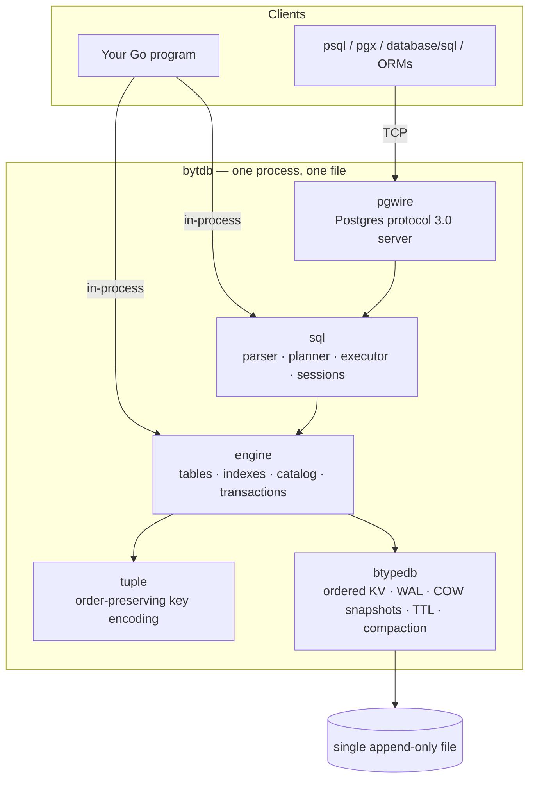

# bytdb

**bytdb** is an embedded relational database written in pure Go, layered over the
[btypedb](https://github.com/rohanthewiz/btypedb) ordered key-value store the way
CockroachDB layers SQL over Pebble: tables, rows, and secondary indexes are all
encoded into one ordered keyspace, so relational operations become key scans.

It speaks enough of the PostgreSQL wire protocol and system catalog that `psql`,
`pgx`, `database/sql`, and ORM introspection probes (GORM, SQLAlchemy,
ActiveRecord) work against it unmodified.



## Why it exists

- **Embedded first.** Point reads run in ~4 µs because there is no network, no
  serialization boundary, and no buffer pool — the working set lives in memory
  as copy-on-write B-trees, durably backed by a write-ahead log.
- **One file, real durability.** Every commit is a CRC-framed, atomically-replayed
  WAL record. Crash recovery is a property the test suite proves with SIGKILL
  and simulated power-loss tests, not a hope.
- **Postgres compatibility where it counts.** SQL with joins, aggregates, window
  functions, transactions and savepoints, `$1` placeholders, Postgres-matching
  error wording and SQLSTATEs, and enough of `pg_catalog` for `psql \d` and ORM
  introspection to work.

## Quick start

### Embedded

```go
import (
    "github.com/rohanthewiz/bytdb"
    bsql "github.com/rohanthewiz/bytdb/sql"
)

e, err := bytdb.Open("app.db")
if err != nil { ... }
defer e.Close()

db := bsql.New(e)
db.Exec(`CREATE TABLE users (id INT PRIMARY KEY, name TEXT NOT NULL, age INT)`)
db.Exec(`INSERT INTO users VALUES ($1, $2, $3)`, 1, "ada", 36)

res, err := db.Exec(`SELECT name FROM users WHERE age > $1 ORDER BY name`, 30)
for _, row := range res.Rows {
    fmt.Println(row[0])
}
```

### As a server

```sh
go run github.com/rohanthewiz/bytdb/pgwire/cmd/bytdbd -db app.db -addr 127.0.0.1:5433
psql "postgres://any@127.0.0.1:5433/any?sslmode=disable"
```

## Documentation map

| Page | What it covers |
|---|---|
| [Architecture](architecture.md) | The keyspace, tuple encoding, WAL and recovery, transactions and COW snapshots, indexes, compaction, the wire server |
| [Features & Examples](features.md) | The full SQL surface with verified examples, the Go APIs, TTL and KV-level features |
| [Considerations & Gotchas](gotchas.md) | What is deliberately not supported, concurrency model, durability nuances, sizing |
| [Testing](testing.md) | Test strategy, crash/power-loss/fuzz/property tests, current coverage |
| [Benchmarks](benchmarks.md) | Measured latencies vs in-memory PostgreSQL, DuckDB, and Redis, with methodology |

## Project layout

| Module / package | Role |
|---|---|
| `github.com/rohanthewiz/bytdb` | Relational engine: catalog, DDL, DML, indexes, transactions |
| `bytdb/tuple` | Order-preserving tuple encoding for keys |
| `bytdb/sql` | Lexer, parser, planner, executor, sessions, system catalog |
| `bytdb/pgwire` | PostgreSQL wire-protocol server (`cmd/bytdbd`) |
| `github.com/rohanthewiz/btypedb` | Storage engine: ordered typed KV, WAL, snapshots, TTL, compaction |
