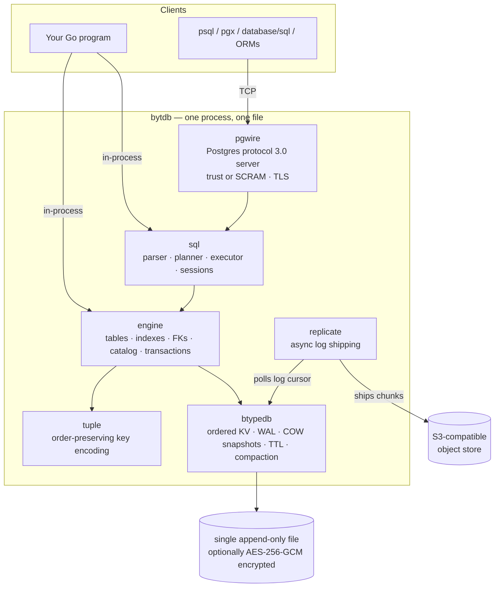

# bytdb

**bytdb** is an embedded relational database written in pure Go, layered over the
[btypedb](https://github.com/rohanthewiz/btypedb) ordered key-value store the way
CockroachDB layers SQL over Pebble: tables, rows, and secondary indexes are all
encoded into one ordered keyspace, so relational operations become key scans.

It speaks enough of the PostgreSQL wire protocol and system catalog that `psql`,
`pgx`, `database/sql`, and ORM introspection probes (GORM, SQLAlchemy,
ActiveRecord) work against it unmodified — including SCRAM-SHA-256(-PLUS)
authentication over TLS when you want more than trust auth.


```mermaid
flowchart TD
    subgraph clients [Clients]
        psql[psql / pgx / database/sql / ORMs]
        goapp[Your Go program]
    end
    subgraph bytdb [bytdb — one process, one file]
        pgw[pgwire<br/>Postgres protocol 3.0 server<br/>trust or SCRAM · TLS]
        sqll[sql<br/>parser · planner · executor · sessions]
        eng[engine<br/>tables · indexes · FKs · catalog · transactions]
        tup[tuple<br/>order-preserving key encoding]
        kv[btypedb<br/>ordered KV · WAL · COW snapshots · TTL · compaction]
        rep[replicate<br/>async log shipping]
    end
    file[(single append-only file<br/>optionally AES-256-GCM encrypted)]
    s3[(S3-compatible<br/>object store)]

    psql -->|TCP| pgw
    goapp -->|in-process| sqll
    goapp -->|in-process| eng
    pgw --> sqll
    sqll --> eng
    eng --> tup
    eng --> kv
    kv --> file
    rep -->|polls log cursor| kv
    rep -->|ships chunks| s3
```

## Why it exists

- **Embedded first.** Point reads run in ~4 µs because there is no network, no
  serialization boundary, and no buffer pool — the working set lives in memory
  as copy-on-write B-trees, durably backed by a write-ahead log.
- **One file, real durability.** Every commit is a CRC-framed, atomically-replayed
  WAL record. Crash recovery is a property the test suite proves with SIGKILL
  and simulated power-loss tests, not a hope.
- **Postgres compatibility where it counts.** SQL with joins (hash joins for
  unindexed equijoins), aggregates, window functions with full frame support,
  CTEs, views, foreign keys with `ON DELETE CASCADE`, transactions and
  savepoints, `$1` placeholders, Postgres-matching error wording and SQLSTATEs,
  and enough of `pg_catalog` for `psql \d` and ORM introspection to work.
- **Operable.** Asynchronous replication to any S3-compatible store with
  point-in-time restore, streaming online backup, and opt-in WAL encryption at
  rest that flows through to replicas and backups automatically.

## Quick start

### Embedded

```go
import (
    "github.com/rohanthewiz/bytdb"
    bsql "github.com/rohanthewiz/bytdb/sql"
)

e, err := bytdb.Open("app.db")
if err != nil { ... }
defer e.Close()

db := bsql.New(e)
db.Exec(`CREATE TABLE users (id SERIAL PRIMARY KEY, name TEXT NOT NULL, age INT)`)
db.Exec(`INSERT INTO users (name, age) VALUES ($1, $2)`, "ada", 36)

res, err := db.Exec(`SELECT name FROM users WHERE age > $1 ORDER BY name`, 30)
for _, row := range res.Rows {
    fmt.Println(row[0])
}
```

### As a server

```sh
go run github.com/rohanthewiz/bytdb/pgwire/cmd/bytdbd -db app.db -addr 127.0.0.1:5433
psql "postgres://any@127.0.0.1:5433/any?sslmode=disable"
```

## Documentation map

| Page | What it covers |
|---|---|
| [Architecture](architecture.md) | The keyspace, tuple encoding, WAL and recovery, transactions and COW snapshots, indexes, foreign keys, the SQL pipeline, compaction, the wire server |
| [Features & Examples](features.md) | The full SQL surface with verified examples, the Go APIs, TTL and KV-level features |
| [Replication & Backup](replication.md) | Litestream-style log shipping to S3, generations, point-in-time restore, online backup |
| [Encryption & Security](security.md) | WAL encryption at rest, SCRAM authentication, TLS, operational hardening |
| [Considerations & Gotchas](gotchas.md) | What is deliberately not supported, concurrency model, durability nuances, sizing |
| [Testing](testing.md) | Test strategy, crash/power-loss/fuzz/property tests, current coverage |
| [Benchmarks](benchmarks.md) | Measured latencies vs in-memory PostgreSQL, DuckDB, and Redis, with methodology |

## Project layout

| Module / package | Role |
|---|---|
| `github.com/rohanthewiz/bytdb` | Relational engine: catalog, DDL, DML, indexes, foreign keys, transactions |
| `bytdb/tuple` | Order-preserving tuple encoding for keys |
| `bytdb/sql` | Lexer, parser, planner, executor, sessions, system catalog |
| `bytdb/pgwire` | PostgreSQL wire-protocol server (`cmd/bytdbd`) |
| `bytdb/replicate` | Asynchronous replication to S3-compatible object stores |
| `github.com/rohanthewiz/btypedb` | Storage engine: ordered typed KV, WAL (optionally encrypted), snapshots, TTL, compaction |
