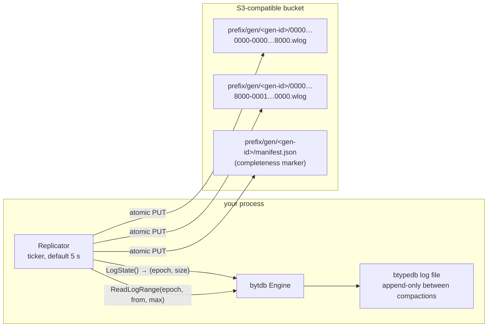
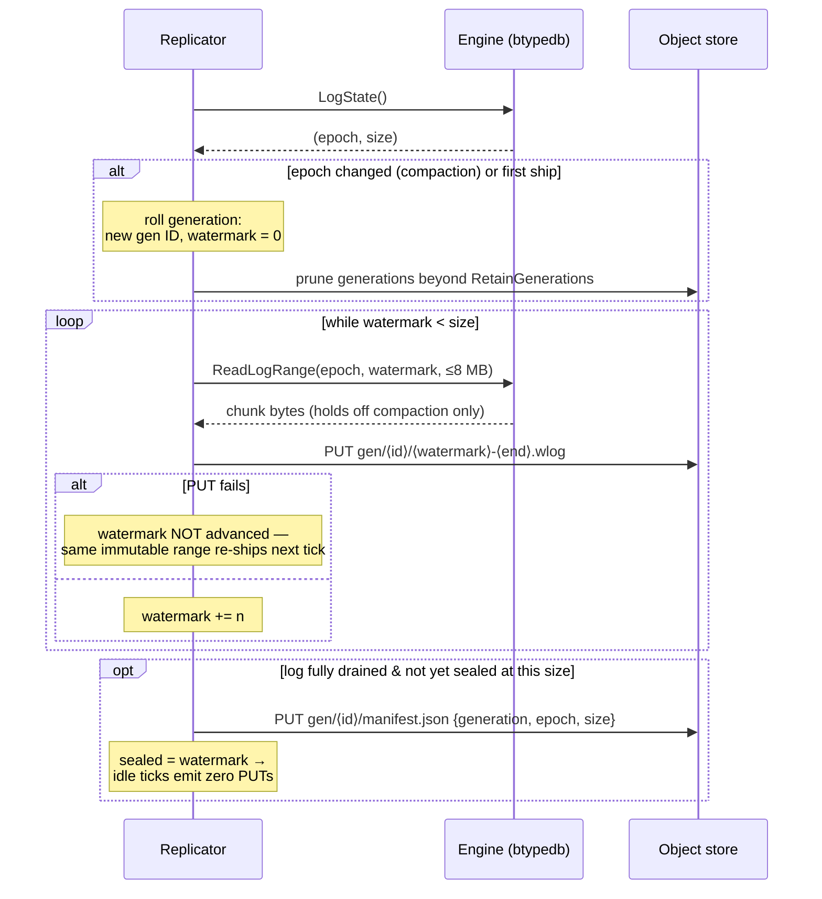
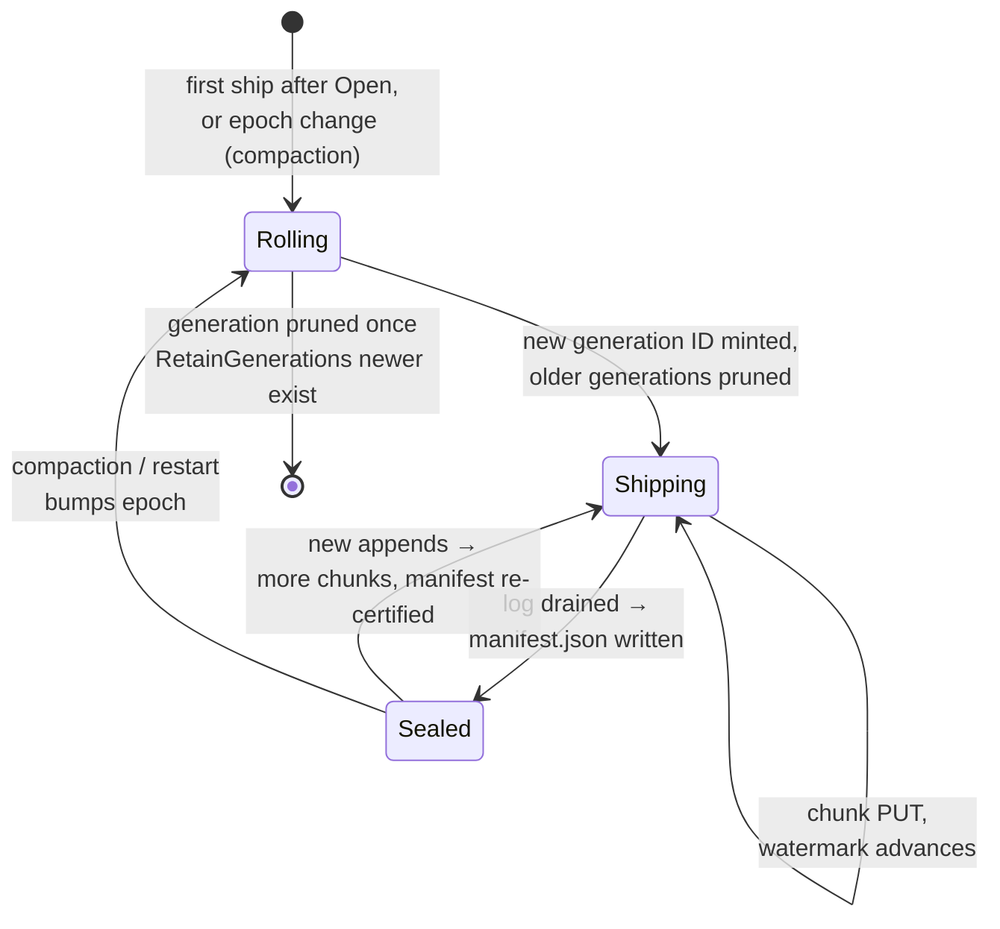
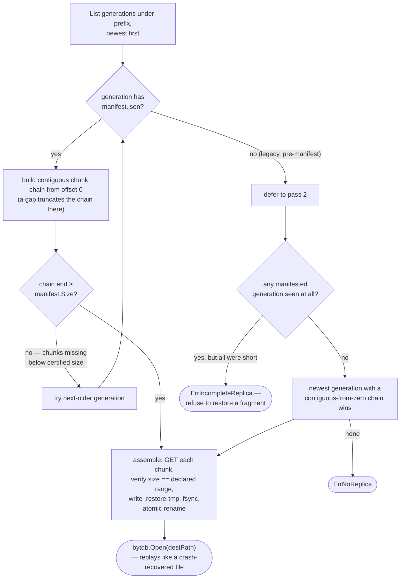

# Replication & Backup

bytdb replicates the way [Litestream](https://litestream.io/) does: the storage
log is append-only between compactions, so incremental replication is **byte-range
shipping** — no page shadowing, no checkpoint racing. The `replicate` package
polls the engine's log cursor and uploads whatever appended since its watermark
as immutable chunk objects in any S3-compatible object store.

This is **recovery, not high availability**: a restored node comes up from
object-store state; it does not fail over live. There is no follower apply loop
and no leader election.



## Quick start

```go
e, _ := bytdb.Open("site.db")

store, _ := s3.New(s3.Config{
    Endpoint:  "https://us-east-1.linodeobjects.com",
    Region:    "us-east-1",
    Bucket:    "db-replicas",
    AccessKey: os.Getenv("S3_ACCESS_KEY"),
    SecretKey: os.Getenv("S3_SECRET_KEY"),
})

r := replicate.New(e, store, replicate.Options{
    Interval: 5 * time.Second, // the data-loss window
    Prefix:   "sites/stjohns",
})
r.Start()
defer r.Close() // final flush; close before e.Close()

// Disaster recovery, elsewhere:
info, _ := replicate.Restore(ctx, store, "sites/stjohns", "site.db")
```

`Replicator.ShipNow(ctx)` forces a synchronous ship (after a critical
transaction, say), and `Status()` returns the current generation, epoch,
watermark, last ship time, and last error — ready for a health endpoint.

## What gets shipped

**Raw byte ranges of the single log file** — not logical records, not WAL
segments. Because btypedb's log *is* the database file, a restore that
concatenates the chunks is a byte-identical prefix of the source file, and it
opens exactly like a crash-recovered local database: every record is CRC-framed
with batch atomicity, so a torn or missing tail chunk costs seconds of data,
never validity.

The object layout (`replicate/replicator.go:363`):

```
<prefix>/gen/<generation-id>/<start>-<end>.wlog   one shipped byte range (offsets as 16-digit hex)
<prefix>/gen/<generation-id>/manifest.json        completeness certificate
```

Generation IDs are UTC timestamps plus a random suffix
(`20060102t150405.000000000-8f2a1c40`), so lexicographic listing order is
chronological order — the `Storage` contract only demands atomic PUT and
ordered listing, which is why the interface is four methods (`Put`, `Get`,
`List`, `Delete`) and anything S3-shaped can stand in.

## The engine's replication cursor

btypedb exposes exactly two primitives (`btypedb/replication.go`), re-exported
on `bytdb.Engine`:

- `LogState() (epoch uint64, size int64)` — the current log identity and how
  many fully-appended bytes are safe to ship. A torn append never advances
  `size`.
- `ReadLogRange(epoch, from, max, w)` — copy `[from, from+max)` of the log
  into `w`, but only if the log is still the one `epoch` names. The copy holds
  off **compaction only** (via `compactMu`); readers and writers are never
  blocked, because the bytes being copied are immutable.

The `epoch` is bumped in exactly one place: after compaction's atomic
rename swaps in the rewritten file (`btypedb/compact.go:93`). Epochs restart
at 0 on `Open`, so a process restart looks like a compaction to the
replicator — deliberately, since crash recovery may truncate a torn tail and
post-restart appends could diverge from previously shipped bytes.

```
writer:   |-- epoch 0 (append-only) --| compact |-- epoch 1 --| ...
follower: ship [0,a) [a,b) [b,c) ...   restart   ship [0,x) ...
```

## The ship cycle

Every tick (and every `ShipNow`) runs the same loop, serialized by a mutex so
manual and timed ships never interleave:



Design points worth knowing:

- **Chunks are immutable.** A failed `PUT` simply re-reads and re-uploads the
  identical range next tick; atomic PUT means there is never a half-object.
- **`ErrEpochChanged` mid-read is not an error** — compaction won the race;
  the ship returns quietly and the next one rolls a fresh generation from
  offset zero.
- **The manifest certifies completeness.** It is written only once the log has
  been fully drained at some size, and re-written as the generation grows.
  Restore uses it to distinguish "complete generation" from "freshly rolled
  generation that has shipped one chunk."
- **Retry policy is the interval itself.** Failures are logged and retried
  next tick — no backoff state to corrupt. `Close()` performs a final flush
  on a fresh 30-second context so shutdown doesn't lose the tail.
- **Chunk size bounds compaction stalls.** `ReadLogRange` holds off compaction
  for the duration of one chunk copy, so `MaxChunkBytes` (default 8 MB) is
  also the knob for the maximum compaction hold.

### Generation lifecycle



Retention defaults to 3 generations (floor of 2); pruning runs at generation
roll, before the new generation's first chunk, and a pruning failure is logged
but never blocks shipping.

## Restore

`replicate.Restore(ctx, store, prefix, destPath)` picks the newest **complete**
generation and reassembles it:



The guarantees this flow encodes:

- **No silent roll-backward.** A freshly rolled generation that has shipped
  only its first chunk is never chosen over a complete older one.
- **No silent fragments.** A certified generation later missing chunks is
  detected (`ErrIncompleteReplica`) rather than restored partially; a chunk
  whose body size disagrees with its declared range is a hard
  "chunk size mismatch" failure.
- **Torn tails are fine.** The chain may extend *past* the certified size —
  extra tail chunks are valid appends, and WAL replay handles any torn final
  record exactly as it would locally.

Restoring a database that was opened with `WithEncryptionKey` requires the
same key at `Open` — see [Encryption & Security](security.md). Chunks of an
encrypted database are ciphertext automatically (the replicator ships raw log
bytes; `replicate/encrypt_replication_test.go` asserts no plaintext ever
reaches the store).

## The bundled S3 client

`replicate/s3` is a dependency-free SigV4 client (stdlib only): virtual-host
or path-style addressing, ListObjectsV2 with continuation paging, and real
payload hashing (never `UNSIGNED-PAYLOAD`). Its HTTP client deliberately sets
**no whole-request timeout** — that would cap a large restore's body
transfer — but bounds every stall point: 10 s dial, 10 s TLS handshake, 30 s
response-header wait. A black-holed endpoint fails a ship in seconds and the
next tick retries, rather than wedging the replicator. Supply your own
`Config.HTTPClient` to override.

There is no multipart upload, and chunks are staged in memory — keep
`MaxChunkBytes` (default 8 MB) well under the single-PUT limit.

## Failure-mode matrix

| Event | Behavior |
|---|---|
| Compaction between ships | Epoch differs → new generation from offset 0; old ones pruned |
| Compaction during a chunk read | `ErrEpochChanged` → quiet return; next ship rolls the generation |
| `PUT` fails | Watermark not advanced; identical immutable range re-ships next tick |
| Manifest write fails | Logged; chunks are already durable, manifest retried on next catch-up |
| Prune fails | Logged only; never blocks shipping |
| Source DB closed | `Run` returns `ErrClosed` (terminal) |
| Shutdown (`Close`) | Final flush on a fresh 30 s context, then stop |
| Black-holed endpoint | Dial/TLS/header timeouts fail the ship in seconds; retried next tick |
| Restore, no data | `ErrNoReplica` |
| Restore, only fragments | `ErrIncompleteReplica` |

## Online backup

Two engine APIs complement replication for one-shot snapshots, both consistent
and non-blocking (writers and readers proceed; only compaction is briefly held
off):

- **`Engine.Backup(destPath)`** — writes a point-in-time copy via temp file +
  fsync + atomic rename. Restoring is just `Open` on the copy.
- **`Engine.BackupTo(w io.Writer)`** — streams the same bytes to any writer,
  for direct-to-bucket snapshots without a local temp file; the caller owns
  destination atomicity (upload to a temp key, or rely on the store's atomic
  PUT).

Both capture only fully-appended bytes (`walSize`), so a backup taken while a
write is mid-append simply stops short of the torn record — the copy always
opens cleanly. **Never copy the live file by hand** while the process runs; a
raw `cp` can catch a torn tail mid-append.
