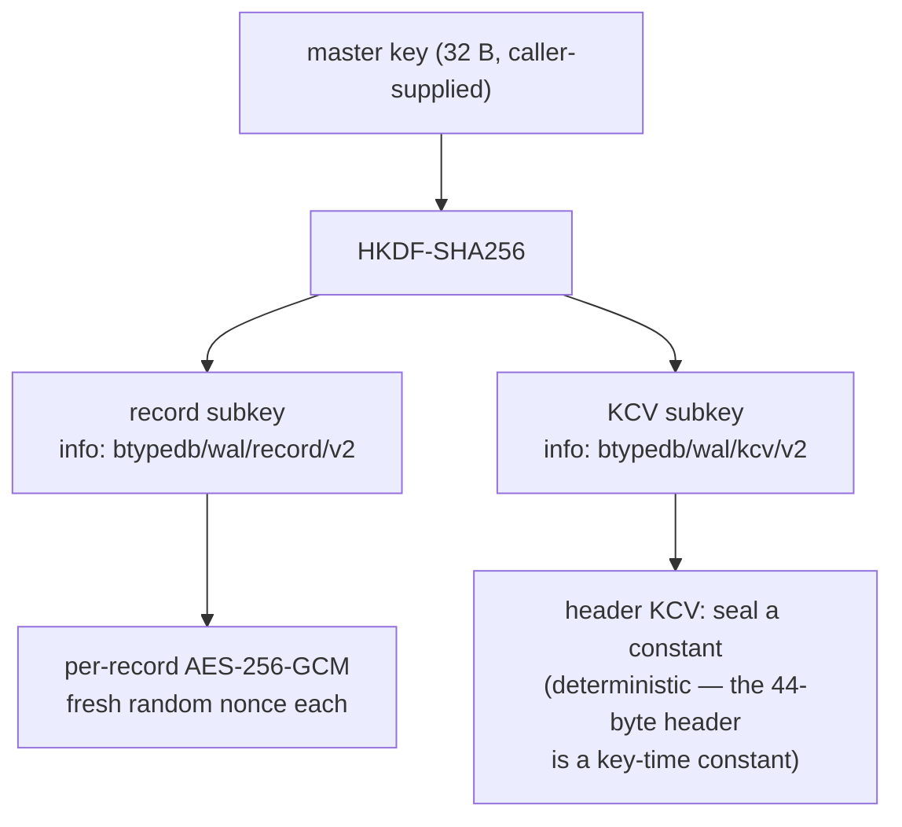
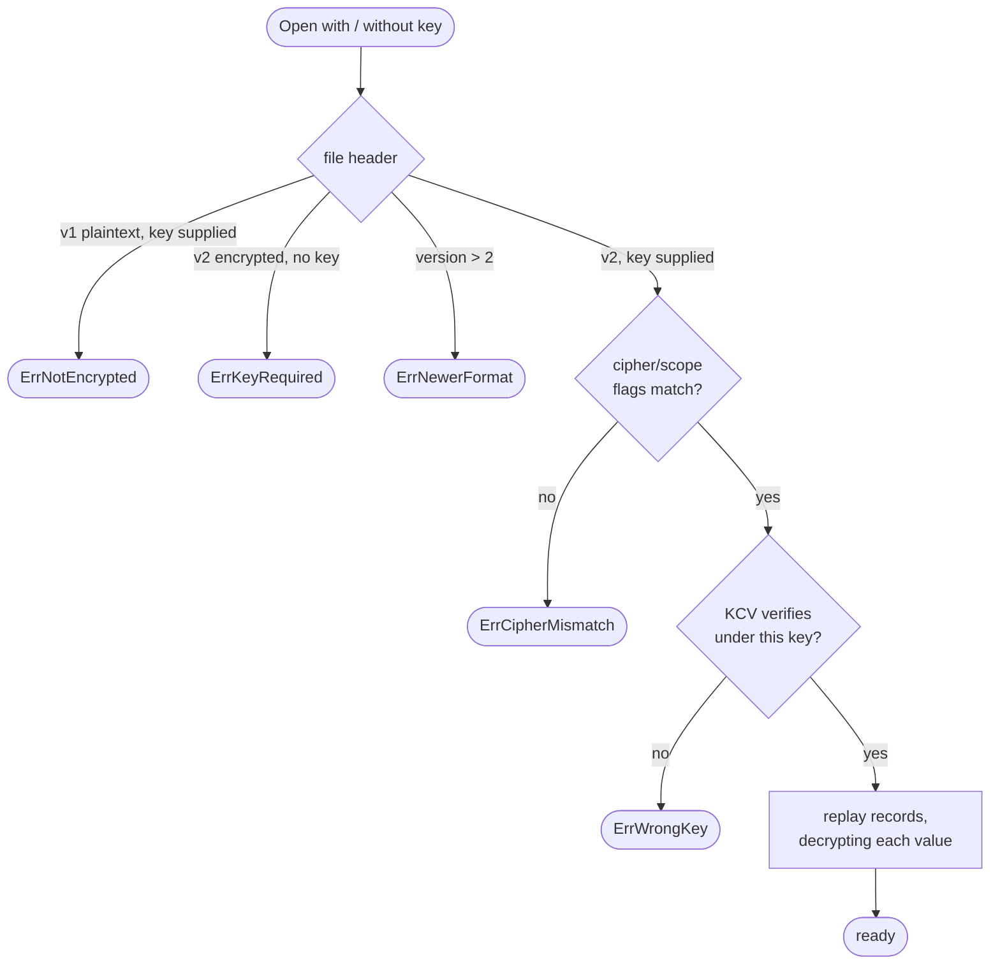
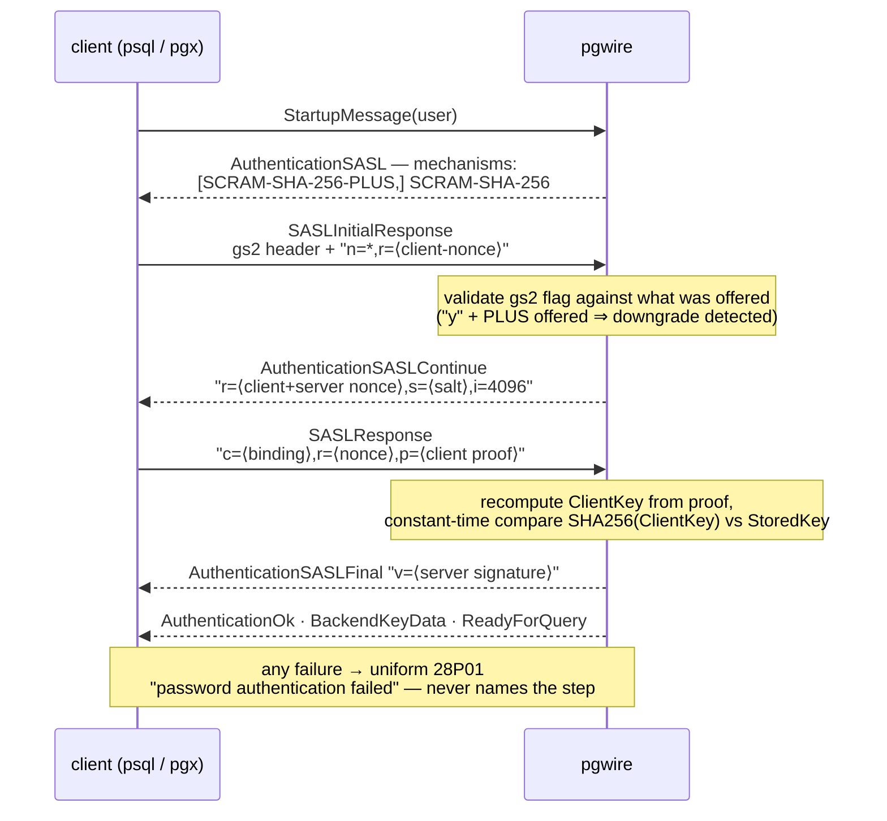

# Encryption & Security

Two independent layers: **encryption at rest** (the storage log becomes
AES-256-GCM ciphertext) and **wire security** (TLS plus SCRAM-SHA-256
authentication with channel binding). Either works without the other.

## Encryption at rest

Open with a 32-byte key and the on-disk log becomes ciphertext, while rows stay
plaintext in memory — the in-memory B-tree orders by the decoded key, so
queries, ordering, and range scans pay no crypto cost:

```go
key := loadKey() // 32 bytes from env / file / your KMS; bytdb never sources or persists it
e, err := bytdb.Open("app.db", bytdb.WithEncryptionKey(key))
```

### What exactly is encrypted

The scope is **value-only**: each record's *value* is sealed; the tuple-encoded
key, the record framing, and the CRC stay cleartext.

```mermaid
flowchart TD
    subgraph rec ["one WAL record on disk (encrypted database)"]
        direction LR
        op["op<br/>(1 B)"] --> kl["klen<br/>(4 B)"] --> vl["vlen<br/>(4 B)"] --> k["key bytes<br/>— cleartext —"] --> v["nonce (12 B) ‖ AES-256-GCM(value)<br/>— ciphertext —"] --> crc["crc32<br/>(4 B)"]
    end
    aad["AAD = op ‖ key bytes<br/>(a record moved to another key or op fails to open)"] -.-> v
```



Consequences of that scope:

- **Torn-tail detection and crash recovery run before any key is needed** —
  the `op|klen|vlen|…|crc32` framing is outside the ciphertext, so replay
  finds the end of the valid log exactly as in a plaintext file, and the CRC
  still catches bit-rot. A decrypt failure *past* a valid CRC is a hard error,
  never mistaken for a torn tail.
- **Primary-key column values are not protected.** The design targets
  databases whose PKs are surrogate IDs/UUIDs. TTL deadlines *are* hidden
  (they are sealed inside the value).
- This protects data at rest — a stolen disk, backup, or object-store
  replica — not a running process's memory.

Each record gets a fresh random 12-byte nonce from `crypto/rand`, stored
inline as the value prefix. Delete records carry no value and are not sealed.

### Keys, header, and fail-fast opens

The 32-byte master key is never used directly: HKDF-SHA256 derives two
subkeys — one for record sealing, one for a header **key-check value** (KCV)
that makes a wrong key fail before any record is read.



Encrypted logs carry a v2 header (44 bytes: magic, version, CRC, cipher
flags, KCV) whose 16-byte prefix is byte-identical in shape to the plaintext
v1 header — so an older, encryption-unaware binary rejects the file cleanly
with a format-version error rather than misreading it.

`Open` reconciles key vs file before reading a single record:



There is **no in-place conversion or online key rotation** yet — migrate (or
rotate) by copying rows into a fresh database opened with the new option.
Compaction re-seals every live record with a fresh nonce and writes a fresh
(byte-identical) header, and splices the recent tail as raw already-sealed
bytes — the encrypted log compacts exactly like a plaintext one.

### Encryption × replication and backup

`Backup`/`BackupTo` and the `replicate` package all ship **raw log bytes**, so
their output is ciphertext automatically — no plaintext ever reaches a bucket
(`replicate/encrypt_replication_test.go` asserts this). A follower or a
`Restore` target needs the **same key** to `Open` and serve. **Lose the key
and the data — and every backup — is unrecoverable.**

### Giving bytdbd the key

`bytdbd` takes the key out-of-band, never on the command line (which would
leak through `ps` and shell history):

```sh
bytdbd -db app.db -encryption-key-file /etc/bytdb/app.key   # or
bytdbd -db app.db -encryption-key-env  BYTDB_KEY
```

The key material may be 32 raw bytes, 64 hex characters, or base64 of 32
bytes. The two flags are mutually exclusive.

## Wire security

### TLS

Set `Server.TLSConfig` (or `bytdbd -tls-cert/-tls-key`) and the server accepts
the Postgres `SSLRequest` upgrade; `Server.RequireTLS` / `-require-tls`
refuses plaintext sessions (SQLSTATE 28000). Two details worth knowing:

- Any bytes a client pipelines *before* the TLS upgrade are rejected
  outright — the plaintext-injection defense.
- `bytdbd` forces TLS ≥ 1.2. GSS encryption requests are declined cleanly.

A 30-second startup timeout bounds the whole handshake (startup + TLS +
authentication), the analogue of Postgres's `authentication_timeout`.

### SCRAM-SHA-256 authentication

Auth is **trust** by default (user/database accepted and ignored — bind to
loopback or a trusted network). With a credentials registry set, RFC 5802
SCRAM-SHA-256 runs for real, and SCRAM-SHA-256-PLUS (channel binding) is
offered when the session is on TLS with an unambiguous server certificate:

```go
creds := pgwire.NewCredentials()
creds.SetPassword("app", "s3cret")                  // hashed immediately; password not retained
creds.SetVerifier("ro", verifierFromPostgres)       // accepts pg_authid-format verifiers verbatim
srv := pgwire.NewServer(db)
srv.Auth = creds
```

Stored credentials use Postgres's own verifier format
(`SCRAM-SHA-256$4096:<salt>$<StoredKey>:<ServerKey>`), so verifiers exported
from a real Postgres `pg_authid` drop in unchanged. Passwords are SASLprep'd
and run through PBKDF2-HMAC-SHA256 (4096 iterations); only the verifier is
ever stored.



Hardening details, all tested (`pgwire/auth_tls_test.go`):

- **Channel binding** is `tls-server-end-point` (RFC 5929): the client's
  `c=` value must embed the SHA-256 hash of the served certificate and is
  covered by the proof, so a relayed/MITM'd handshake fails. A client that
  says "I support binding but chose not to" (`y,`) while the server offered
  PLUS trips the RFC 5802 **downgrade detection**.
- **Unknown users are indistinguishable from wrong passwords**: the server
  synthesizes a deterministic mock verifier for unknown users and folds the
  "user exists" bit in only after the constant-time proof comparison.
- Every failure path returns the same FATAL 28P01 message.

### Query cancellation and timeouts

Out-of-band cancellation works as in Postgres: the server issues real
`BackendKeyData` (crypto-random secrets), and a `CancelRequest` on a fresh
connection — accepted before auth, by design, since the issuing session is
blocked — cancels the matching backend if pid *and* secret match, silently
otherwise (so cancellation can't probe live PIDs). A cancelled statement
returns SQLSTATE 57014 and the connection survives.

The timeout lineup:

| Timeout | Default | Effect |
|---|---|---|
| `SET statement_timeout` | 0 (off) | Bounds every statement; 57014 on expiry — a runaway query no longer wedges the global writer lock |
| Idle-in-transaction | **5 min, on by default** | FATAL 25P03; deliberately non-Postgres default, because a writable block holds bytdb's single writer lock |
| Idle session | off | FATAL 57P05 when enabled |
| Startup (incl. TLS + SCRAM) | 30 s | Connection dropped |
| I/O read/write | 60 s | Connection dropped |
| Max connections | 100 | FATAL 53300 "sorry, too many clients already"; cancel connections are exempt |

Each connection also has resource ceilings (16 K prepared statements/portals,
bounded message-body preallocation) and a per-connection panic fence that
returns XX000 instead of killing the process.

## bytdbd flag reference

| Flag | Default | Meaning |
|---|---|---|
| `-db` | *(required)* | Database file, created if absent |
| `-addr` | `127.0.0.1:5433` | Listen address |
| `-auth-file` | *(trust)* | `user:password` or `user:SCRAM-SHA-256$...` per line; `#` comments |
| `-tls-cert` / `-tls-key` | — | PEM pair; enables the `SSLRequest` upgrade |
| `-require-tls` | false | Refuse non-TLS sessions |
| `-encryption-key-file` / `-encryption-key-env` | — | WAL encryption key (32 raw bytes, 64 hex, or base64) |
| `-sync` | `always` | WAL fsync policy: `always` or `never` |
| `-idle-tx-timeout` | `0` (= 5 min) | Negative disables |
| `-max-conns` | `0` (= 100) | Connection cap |
| `-log-queries` | false | Log SQL, duration, and outcome per statement |

Configuration is validated before the database opens, so a bad flag can never
strand a half-open engine.
