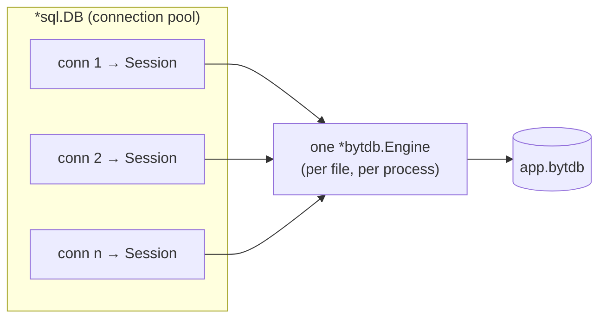

# The `database/sql` Driver

The `bytdb/stdlib` package registers bytdb as a `database/sql` driver named
`bytdb`, so the embedded engine can be reached through the interface the Go
ecosystem already speaks: sqlx, ORMs, migration tools, and any code written
against `*sql.DB`.

It is the in-process counterpart to the [wire server](architecture.md). Both
put bytdb behind `database/sql`; this one does it with no server, no socket,
and no wire encoding, at the cost that the database lives in the calling
process. Everything on this page is verified by `stdlib/stdlib_test.go`.

```go
import (
    "database/sql"
    _ "github.com/rohanthewiz/bytdb/stdlib"
)

db, err := sql.Open("bytdb", "app.bytdb?concurrent_writes=true")
```

## The DSN

A filesystem path, optionally followed by engine options —
`app.bytdb`, `file:app.bytdb`, `/var/lib/app.bytdb?sync=never`. bytdb has no
in-memory mode, so a path is always a real file, created on first open.

| Option | Effect |
|---|---|
| `sync=never` | Leave WAL fsyncs to the OS: much faster writes, at the risk of losing recently acknowledged transactions to a power loss (not a process crash). Omitted, the engine's `SyncAlways` default stands. |
| `concurrent_writes=true` | Optimistic concurrency instead of the single-writer lock — commits may then fail with `bytdb.ErrTxConflict`, and sequences become gap-tolerant. See [Concurrency & Isolation](concurrency.md). |
| `encryption_key=<64 hex digits>` | Encrypt the WAL at rest with the 32-byte key. Opening with the wrong key, or without one, fails. See [Encryption & Security](security.md). |

An unrecognized option is an error rather than a silent no-op: a typo in a
durability or encryption setting should not be something you discover from
its consequences. `stdlib.ParseDSN` exposes the parse for tooling.

## One engine per file

btypedb takes the database file for itself, so one path is one engine per
process. Every `*sql.DB` on a path shares that engine, and every pooled
connection gets its own bytdb Session — one engine, many sessions, the same
shape the wire server serves:



Opening the same path twice with *different* options is an error rather than
a silent adoption of whichever option set got there first.

Two functions bridge to the rest of the Go API:

- **`stdlib.OpenEngine(e)`** wraps an `*bytdb.Engine` the program already
  holds — the file cannot be opened twice, so a DSN would fail. The caller
  keeps ownership: closing the returned `*sql.DB` leaves the engine open.
- **`stdlib.Engine(ctx, db)`** goes the other way, reaching the engine behind
  a `*sql.DB` for work the SQL dialect does not cover — ordered range scans,
  index scans, the tuple encoding.

## Transactions and conflicts

`BeginTx` maps `database/sql`'s isolation levels onto `BEGIN`'s. The four
Postgres levels pass through (`READ UNCOMMITTED` folding into
`READ COMMITTED`, as on Postgres, and `LevelSnapshot` mapping to
`REPEATABLE READ`); the levels `database/sql` defines beyond those are
refused rather than silently downgraded. `TxOptions.ReadOnly` becomes
`BEGIN READ ONLY`, which takes no writer lock.

Under `concurrent_writes=true`, a losing commit returns
`bytdb.ErrTxConflict` — match it with `errors.Is` or the
`stdlib.IsRetryable` shorthand, and re-run the transaction from the top:

```go
for {
    err := transfer(ctx, db, from, to, amount) // BeginTx ... Commit inside
    if stdlib.IsRetryable(err) {
        continue // lost the race; re-read and re-apply
    }
    return err
}
```

Autocommit statements never surface a conflict — bytdb retries those
internally (up to three times) before giving up, exactly as over the wire.
See [Concurrency & Isolation](concurrency.md) for the full contract.

!!! note "No `LastInsertId`"
    bytdb draws identity values through `RETURNING` rather than a
    last-insert-id, so `Result.LastInsertId` returns an error pointing at
    `INSERT ... RETURNING` — use `QueryRow(...).Scan(&id)`.

## Types across the boundary

The date/time and UUID types ride on `int64` and `[]byte` runtime
representations so they sort in the key encoding; the driver decodes them
back on the way out:

| Column type | Scans as |
|---|---|
| `timestamp` / `timestamptz` | `time.Time` (UTC) |
| `date` | its text form, `2026-08-04` |
| `uuid` | its canonical text form |
| `text[]` | the canonical Postgres array literal |
| `jsonb` | the canonical (compact, keys-sorted) document |

`time.Time` arguments are accepted on the way in and formatted as UTC
timestamp literals. `ColumnTypeDatabaseTypeName` and `ColumnTypeScanType`
report both sides for the ORMs that ask.

## What `database/sql` cannot carry

A statement's Notice (bytdb's warning for a redundant `BEGIN`, say) and its
tag override (a `COMMIT` that actually rolled back) have nowhere to go in
`database/sql`'s interfaces and are dropped. Callers who need them should
use the [`sql` package](features.md#the-go-apis) directly, or reach the
engine through `stdlib.Engine`.

## Choosing an entry point

| You have / need | Use |
|---|---|
| Code, ORMs, or tools written against `*sql.DB`, one process | **`stdlib`** (this driver) |
| A Go program that can speak bytdb's own API | [`bytdb/sql`](features.md#the-go-apis) — richer results, Notices, tag overrides |
| Typed relational operations without SQL, ordered scans | The [Engine API](features.md#the-go-apis) |
| Multiple processes or non-Go clients | The [wire server](security.md) (`pgwire`, `cmd/bytdbd`) |
