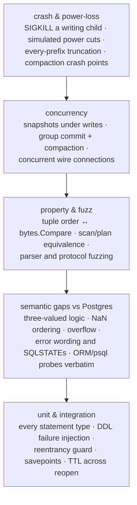

# Testing

bytdb's test suite is built around one conviction: **a storage engine's
correctness claims are only as good as its crash tests**. The suite covers
five tiers, from unit tests up to SIGKILL-under-load and simulated power
loss.

## Current coverage

Measured with `go test -count=1 -cover ./...` (Go 1.26.1, 2026-07-08):

| Package | Coverage | What it is |
|---|---:|---|
| `bytdb` (engine) | **83.9%** | Catalog, DDL, DML, indexes, transactions |
| `bytdb/sql` | **83.2%** | Lexer, parser, planner, executor, sessions, syscat |
| `bytdb/tuple` | **91.1%** | Order-preserving key encoding |
| `bytdb/pgwire` | **87.2%** | Wire protocol server |
| `btypedb` (storage) | **83.1%** | KV store, WAL, snapshots, TTL, compaction |

Across the repositories: **281 test functions** and **4 fuzz targets**
(`FuzzTupleRoundTrip`, `FuzzTupleOrder`, `FuzzMessageParse`, `FuzzParse`).
(`pgwire/cmd/bytdbd` is a flag-parsing `main` and is intentionally untested.)

## The five tiers



### Crash safety (the tier that matters most)

- **`TestCrashRecovery`** (`btypedb/crash_test.go`) repeatedly SIGKILLs a child
  process that is writing 8-key batch transactions, then reopens and asserts
  the transactional invariant: every batch present after recovery has *all 8
  members with one identical value* — no torn or interleaved transaction ever
  survives — and the recovered store accepts new writes.
- **Power-loss simulation** (`powerfail_test.go`): a model filesystem where only
  fsync-promoted bytes survive a "cut", which then keeps an *arbitrary torn
  prefix* of in-flight bytes. `TestPowerLossEveryPrefix` replays recovery for
  every possible truncation point of the tail.
- **Compaction crash points** (`powerfailfs_test.go`): a cut during compaction
  leaves either the old or the new complete log, never a hybrid; leftover
  `.compact` temp files are proven dead.
- The bytdb layer adds its own `crash_test.go` plus **DDL failure injection**
  (`ddl_failure_test.go`): a hook simulates the WAL append failing at commit
  time, proving a failed `CREATE INDEX`/`ALTER` leaves no half-published
  schema.

### Property and fuzz tests

- `FuzzTupleOrder` checks the load-bearing invariant of the whole design:
  `bytes.Compare(Encode(a), Encode(b))` always equals the semantic comparison.
  `FuzzTupleRoundTrip` proves decode ∘ encode is the identity.
- `scan_property_test.go` and `sql/plan_property_test.go` cross-check scan and
  planner results against brute-force evaluation over generated data.
- `FuzzParse` (SQL text) and `FuzzMessageParse` (wire bytes) assert no input
  can panic the parser or the protocol reader (`pgwire/panic_test.go` adds a
  panic fence test for the executor path).

### Fidelity to Postgres

`sql/semantic_gaps_test.go` and `sql/limits_test.go` pin the deliberate edge
behaviors: `NOT IN` with NULL collapsing to zero rows, NaN sorting last,
LIMIT/OFFSET overflow saturation, error wording (`operator does not exist`,
check-violation messages) matching Postgres closely enough that SQLSTATE
mapping works by message text. `pgwire/orm_test.go` and `sql/psql_test.go`
replay **verbatim** introspection queries captured from psql 17, GORM,
SQLAlchemy, and ActiveRecord.

## Running the suite

```sh
# root module (engine, sql, tuple) — go.work covers pgwire too
go test ./...

# with coverage
go test -count=1 -cover ./...

# the other modules
(cd pgwire && go test -cover ./...)
(cd ../btypedb && go test -cover ./...)

# fuzzing (continuous; ctrl-C when satisfied)
go test -fuzz=FuzzTupleOrder ./tuple
(cd sql && go test -fuzz=FuzzParse)
```

The crash and power-loss tests run as part of the normal suite — no special
flags — which is why `btypedb`'s suite takes ~25 s.
